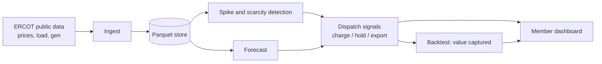

# GridSignal

Turning ERCOT grid data into battery dispatch signals that Base Power members can act on.

Built at the Base Power x AITX Talent Hackathon, Austin, Sep 25 to 27, 2026.

**Tracks:** Open Grid Data + Most Commercializable

## Problem

TODO (1 to 2 sentences): what most people miss in ERCOT data, and why it matters to a home battery owner.

## Solution

TODO: the core loop in one paragraph. Ingest ERCOT prices, load and generation, then detect and forecast scarcity and price-spike windows by load zone, then recommend charge, hold or export, and show the dollar value captured.

## Quick Start

```bash
git clone https://github.com/Regantih/gridsignal.git
cd gridsignal
python -m venv .venv && source .venv/bin/activate
pip install -e ".[dev]"
cp .env.example .env          # add keys if you use the ERCOT API
python -m gridsignal.pipeline # ingest -> detect -> forecast -> signals
streamlit run app/dashboard.py
```

## Tech Stack and Architecture

- Python 3.11, pandas, gridstatus (ERCOT access), scikit-learn
- Streamlit dashboard
- Local Parquet storage in `data/`



See `docs/architecture.md` for details.

## Reproducing the Demo

1. Copy `.env.example` to `.env` and fill in any keys.
2. Run `python -m gridsignal.pipeline --start 2026-08-01 --end 2026-09-24`.
3. Run `streamlit run app/dashboard.py` and select a load zone.

## Data and Provenance

| Dataset | Source | Notes |
|---|---|---|
| Real-time settlement point prices | ERCOT, via gridstatus | TODO |
| System load | ERCOT, via gridstatus | TODO |
| Fuel mix / generation | ERCOT, via gridstatus | TODO |
| Synthetic battery fleet | Generated in `src/gridsignal/fleet.py` | TODO |

## Known Limitations and Next Steps

- TODO

## Team

| Name | Role | Contact |
|---|---|---|
| Hemanth Reganti | TODO | TODO |

## Hackathon Compliance

All code in this repo was written during the hackathon (Sep 25 to 27, 2026). Third-party open-source libraries are listed in `pyproject.toml`.
