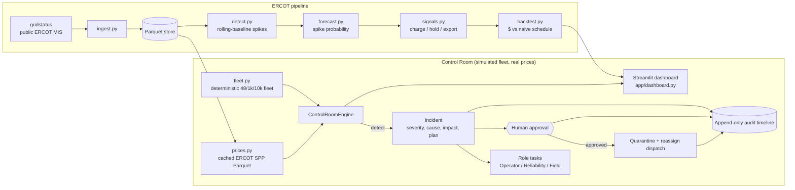

# GridSignal

Turning ERCOT grid data into battery dispatch signals that Base Power members can act on —
plus **GridSignal Control Room**, a simulation-only operator view that keeps a distributed
home-battery fleet coordinated when a device fails.

Built at the Base Power x AITX Talent Hackathon, Austin, Sep 25 to 27, 2026.

**Tracks:** Orchestration (Control Room) + Open Grid Data

> **Simulation only.** The fleet, the failure and the recovery are deterministic local mock data;
> only the ERCOT settlement prices are real (a cached public price trace). It does not connect to
> real devices, utilities, ERCOT operational systems or any control plane, and it never dispatches
> anything. A human operator must approve every recovery action.

## Problem

A home-battery fleet is only worth what it can reliably deliver during a grid event. When a single
device goes dark mid-event, the operator has to notice it, understand what it costs the fleet's
commitment, decide what to do, and coordinate engineers and field techs — usually across dashboards,
chat and spreadsheets, under time pressure.

## Solution

GridSignal Control Room closes that loop in one screen: telemetry loss becomes a typed incident with
a root-cause hypothesis and quantified impact, the orchestrator proposes a recovery plan and fans out
role-specific tasks, **a human approves**, and only then is the failed device quarantined and its
committed kW reassigned across healthy headroom — with an immutable audit timeline of the whole
sequence.

The impact is priced against **real ERCOT data**: the grid event sits on the most expensive
two-hour window of a real LZ_HOUSTON trading day, so the incident shows dollars at risk
(`kW x hours x $/MWh`) before approval and dollars recovered after it.

Two dials in the sidebar make that number mean something at Base's scale:

- **Price scenario** — a normal peak day (2026-09-22, peak $199.74/MWh) or a real ERCOT
  scarcity day (2023-09-06, peak $5,147.65/MWh, settlement at the offer cap plus reserve adders).
- **Fleet scale** — 48, 1,000 or 10,000 simulated devices. The failure is a gateway firmware
  ring that covers one device in 48, so a 10,000-device fleet loses 208 devices to the same
  root cause. On the scarcity day that is **$8,971 at risk and $8,684 recovered** from one
  operator approval, versus $1.82 on the 48-device normal day.

## Quick Start

One command starts the demo from a fresh clone (after install):

```bash
git clone https://github.com/Regantih/gridsignal.git
cd gridsignal
python3.11 -m venv .venv && source .venv/bin/activate
pip install -e ".[dev]"
streamlit run app/dashboard.py     # -> http://localhost:8501
```

No API keys, accounts or network access are required: a cached ERCOT price trace is bundled in
`data/processed/`. `.env` is optional and only used by the live-ERCOT pipeline
(`pip install -e ".[ercot]"`).

Refresh the cached prices from ERCOT's public MIS reports (needs the `[ercot]` extra and network,
still no credentials):

```bash
python -m gridsignal.ingest --date 2026-09-22          # LZ_HOUSTON real-time 15-min SPP
python -m gridsignal.ingest --scarcity-year 2023       # highest-priced day of that year
```

## Tests and formatting

```bash
pytest -q          # failure -> incident -> approval -> recovery state flow
ruff check .
ruff format --check .
```

## Using the dashboard

The sidebar **View** switch picks between the three pages:

### Control Room

- **Trigger BAT-042 Failure** (sidebar) — simulate the telemetry blackout.
- **Approve Recovery Plan** (incident panel) — the human gate; nothing moves until it is clicked.
- **Reset Demo** (sidebar) — replay the story without reloading the browser.
- **Price scenario / Fleet scale** (sidebar) — switch between the normal and scarcity ERCOT days
  and between 48, 1,000 and 10,000 devices; either rebuilds the simulation from its stable state.

### Member App

The same incident seen from one house, deliberately kept separate from the operator tooling:
hours of whole-home backup still held in reserve, the dollars the battery earned in the event and
the dollars it helped protect when a neighbour dropped out, plus a plain-English notice about the
device issue and its resolution. Pick any home in the sidebar; BAT-042 is the one that fails.
Trigger the failure from the Control Room (or the sidebar controls on this page) and the member
copy moves from "Your battery is healthy" to "We've lost contact with your battery" to
"Resolved" — with no incident IDs, kW targets or approval controls exposed to the homeowner.

Member-facing numbers use two explicit assumptions: a **1.2 kW essential household load** for
backup hours and a **60% member revenue share** of the grid value their battery creates. Neither
is a Base Power tariff.

### Grid Signals

An offline analytics view over the same bundled ERCOT day: rolling-baseline spike detection, a
spike-probability forecast, charge/hold/export signals for a 13.5 kWh / 5 kW battery, and a
backtest against a naive 1–5am charge / 5–9pm export schedule. The headline number is the extra
revenue at the selected fleet scale ($28,100/day across 10,000 batteries on the 2023-09-06
scarcity day). Signals are advisory; nothing is dispatched.

Below the charts the same view shows the **held-out scorecard** — the identical policy replayed on
seven real LZ_HOUSTON days it was never tuned on, including the days it loses on (see
[Held-out results](#held-out-results-out-of-sample)).

Same numbers from the CLI:

```bash
python -m gridsignal.pipeline --scenario scarcity --devices 10000
python -m gridsignal.holdout          # the held-out scorecard
```

Full walkthrough, safety boundaries and a 60–90 second demo script: [`docs/DEMO.md`](docs/DEMO.md).

## Tech Stack and Architecture

- Python 3.11, Streamlit, Plotly, pandas
- `gridstatus` + scikit-learn only for refreshing ERCOT data and the optional pipeline
  (`.[ercot]` extra)
- Control Room state lives in memory; ERCOT prices are cached as Parquet in `data/processed/`



| Module | Responsibility |
|---|---|
| `src/gridsignal/fleet.py` | Deterministic synthetic fleet (seeded, 48/1,000/10,000 devices, BAT-042 is the demo device) and its gateway rings |
| `src/gridsignal/control_room/models.py` | Device, GridEvent, Incident, Task, AuditEvent, FleetSnapshot |
| `src/gridsignal/control_room/engine.py` | State machine: baseline → failure → incident → **human approval** → recovery |
| `src/gridsignal/ingest.py` | Pulls real-time settlement point prices from ERCOT via gridstatus and caches them as Parquet |
| `src/gridsignal/prices.py` | Named price scenarios, cached-trace loading, peak-window selection, kW to dollars |
| `src/gridsignal/detect.py` | Rolling trailing-median baseline with a MAD spread; flags spike intervals and groups them into windows |
| `src/gridsignal/forecast.py` | Causal spike-probability score from the z-score, its ramp and the price-over-baseline level |
| `src/gridsignal/signals.py` | Declining reservation price turning prices plus spike probability into charge/hold/export |
| `src/gridsignal/backtest.py` | Battery settlement ledger (SoC, cashflow) for the signals and for a naive fixed schedule |
| `src/gridsignal/pipeline.py` | `run(scenario)` wiring detect → forecast → signals → backtest, plus a CLI |
| `src/gridsignal/member.py` | Member-facing summary for one home: backup hours, earned/protected dollars, plain-English notice |
| `src/gridsignal/holdout.py` | Replays the frozen policy over the bundled held-out days and scores it against the naive schedule |
| `scripts/fetch_holdout.py` | Caches the held-out days from ERCOT (needs `.[ercot]` and network); the selection rule is in its docstring |
| `app/dashboard.py` | Single-page operator UI: overview, map/grid, price trace, incident, tasks, audit, demo controls |
| `tests/test_control_room.py` | End-to-end coverage of the failure-to-recovery flow, including the dollar math |
| `tests/test_prices.py`, `tests/test_ingest.py` | Scenario loading, peak-window selection, dollar conversion, cache provenance |
| `tests/test_scale.py` | Gateway-ring scaling, scarcity pricing, and a 10,000-device detect-plus-reallocate benchmark |
| `tests/test_detect.py`, `tests/test_forecast.py`, `tests/test_signals.py`, `tests/test_backtest.py`, `tests/test_pipeline.py` | The analytics pipeline: spike detection, look-ahead safety, dispatch policy, settlement math, end-to-end run |
| `tests/test_holdout.py` | Held-out set integrity: ≥5 real days with provenance, no tuned-on day scored, frozen thresholds, losing days kept in the totals |

See [`docs/architecture.md`](docs/architecture.md) for the data-pipeline side.

## Reproducing the Demo

1. `streamlit run app/dashboard.py`, open http://localhost:8501.
2. Click **Trigger BAT-042 Failure**, read the incident panel, click **Approve Recovery Plan**.
3. Click **Reset Demo** to replay. Results are identical every run (seeded simulation).

Optional live-data path: `pip install -e ".[ercot]"`, then `python -m gridsignal.ingest --date
<recent date>` to refresh the cached trace before running the pipeline against it.

## Data and Provenance

| Dataset | Source | Notes |
|---|---|---|
| Simulated battery fleet | `src/gridsignal/fleet.py` | Seeded synthetic data, no real customer or device data |
| Simulated grid event | `src/gridsignal/control_room/engine.py` | 5 kW per device over 2 h (240 kW at 48 devices, 50 MW at 10,000); the window is chosen from the real price trace |
| Real-time settlement point prices | ERCOT MIS [NP6-905-CD](https://www.ercot.com/mp/data-products/data-product-details?id=NP6-905-CD) via `gridstatus`, public and credential-free | **Real data.** LZ_HOUSTON, REAL_TIME_15_MIN, 2026-09-22 (96 intervals, peak $199.74/MWh). Cached at `data/processed/lz_houston_rtm_spp_sample.parquet` with provenance in the sidecar `.json`; refresh with `python -m gridsignal.ingest --date <YYYY-MM-DD>` |
| Scarcity-day settlement prices | ERCOT MIS [NP6-785-ER](https://www.ercot.com/mp/data-products/data-product-details?id=NP6-785-ER) historical archive via `gridstatus`, public and credential-free | **Real data.** LZ_HOUSTON, REAL_TIME_15_MIN, 2023-09-06 — the highest-priced LZ_HOUSTON day of 2023 (96 intervals, peak $5,147.65/MWh, day average $788.49/MWh). The archive restates some intervals, so repeated intervals are averaged into one row. Cached at `data/processed/lz_houston_rtm_spp_scarcity_sample.parquet` with a sidecar `.json`; refresh with `python -m gridsignal.ingest --scarcity-year <YYYY>` |
| Held-out evaluation days | ERCOT MIS [NP6-785-ER](https://www.ercot.com/mp/data-products/data-product-details?id=NP6-785-ER) historical archive and [NP6-905-CD](https://www.ercot.com/mp/data-products/data-product-details?id=NP6-905-CD) daily report via `gridstatus` | **Real data.** Seven LZ_HOUSTON REAL_TIME_15_MIN days, 96 intervals each, cached under `data/holdout/` with a sidecar `.json` per day; refresh with `python scripts/fetch_holdout.py` |
| System load / fuel mix | ERCOT, via gridstatus | Not implemented yet (`ingest.fetch_load`, `ingest.fetch_fuel_mix`) |

Dollars are computed as `kW x hours x $/MWh / 1000` over the part of the event window that is still
ahead. Both price days are real; the fleet, the outage and the recovery are simulated, and the
historical scarcity trace is pricing context only — it is not replayed as a real-time market feed.

## Held-out results (out of sample)

The charge/hold/export thresholds were written against the two scenario days above, so scoring
them on those same days says nothing. These seven days are held out: the policy had never seen
them, the thresholds were frozen before scoring, and **nothing was retuned after seeing these
numbers** — the losing days are printed as they came out.

Day selection is a rule, not a hand-pick (`scripts/fetch_holdout.py`): for each year the ERCOT
archive parses, take that year's highest-priced LZ_HOUSTON day and its median-peak day; 2023's
peak day is excluded because the policy was written against it. The archive does not parse 2026
yet, so the two most recent complete trade days from the daily report are used instead.

All figures are **dollars per battery per day** on a 13.5 kWh / 5 kW battery (see Assumptions).

| Date | Peak $/MWh | Regime | GridSignal $ | Naive $ | Uplift $ |
|---|---:|---|---:|---:|---:|
| 2023-04-06 | 86.13 | ordinary | 0.06 | 0.19 | **−0.13** |
| 2024-05-08 | 4,981.40 | scarcity | 11.24 | 16.13 | **−4.89** |
| 2024-12-20 | 73.13 | ordinary | −0.34 | 0.27 | **−0.61** |
| 2025-04-07 | 3,860.63 | scarcity | 5.15 | −0.97 | **+6.12** |
| 2025-05-03 | 76.33 | ordinary | 0.43 | 0.01 | **+0.42** |
| 2026-09-23 | 97.76 | ordinary | −0.63 | 0.46 | **−1.09** |
| 2026-09-24 | 108.74 | ordinary | −0.33 | 0.57 | **−0.90** |

**2 of 7 held-out days beat the naive schedule.** Mean −$0.15, median −$0.61, worst −$4.89, best
+$6.12 per battery per day. Read honestly: the in-sample uplift does not survive out of sample.
The policy's edge is concentrated in scarcity days where the spike lands outside the naive export
window (2025-04-07), and it gives value back on ordinary days by holding charge for a spike that
never arrives. A deployable version needs a trained probability model and a cost for holding, not
a retune against this table — retuning on it would destroy the only out-of-sample evidence here.

Reproduce with `python -m gridsignal.holdout`.

### Assumptions (not measured fleet data)

Member view: essential household load **1.2 kW** (backup hours = reserved kWh ÷ 1.2 kW), member
revenue share **60%** of the grid-event value their battery creates.

Every dollar figure in this repository rests on these stated assumptions about a single home
battery. They are round numbers chosen to be representative; they are **not** measurements of any
real Base Power device or fleet.

| Assumption | Value | Where |
|---|---|---|
| Usable energy capacity | 13.5 kWh | `backtest.DEFAULT_KWH` |
| Inverter power, charge and discharge | 5 kW (so 1.25 kWh per 15-minute interval) | `backtest.DEFAULT_POWER_KW` |
| Round-trip efficiency | 90% | `backtest.ROUND_TRIP_EFFICIENCY` |
| Naive baseline schedule | charge 01:00–05:00, export 17:00–21:00 | `backtest.NAIVE_CHARGE_HOURS`, `NAIVE_EXPORT_HOURS` |
| Starting state of charge | empty at 00:00 | `backtest.value_captured` |
| Market participation | price taker settling at the RTM SPP; no bidding, no ancillary revenue, no degradation cost, no losses beyond round-trip efficiency | `backtest.py` |
| Control Room event | 5 kW of capacity per affected device over a 2-hour window | `control_room/engine.py` |

## Known Limitations and Next Steps

- The Control Room is a simulation: no device protocol, no telemetry ingest, no persistence
  (state lives in the Streamlit session and resets on server restart).
- Detection is a single rule (telemetry staleness) on one scripted device rather than a monitor
  over a real event stream.
- The spike forecast is a fixed-coefficient logistic score, not a trained model, and the backtest
  is a price-taker single-day replay: no bidding, no ancillary services, no degradation cost.
- **The policy does not yet generalise**: it loses to the naive schedule on 5 of 7 held-out days
  (above). The honest read is that the in-sample numbers are in-sample, and the next real step is
  a trained spike model plus an opportunity cost for holding charge — not threshold tweaking.
- Load and fuel-mix ingest are implemented but not yet used by either view.
- ERCOT's public SPP report only keeps roughly the last week online, so `--date` must be recent;
  scarcity days come from the yearly historical archive instead. Both bundled samples are the
  cached copies that keep the demo reproducible and offline.
- Scaling is a device multiplier on one seeded template, not a model of real per-home diversity,
  and the fleet map thins healthy markers above 400 devices.
- Next: drive the whole event window as a replay (price tick by price tick) so the operator sees
  exposure change minute to minute rather than as a single window average.

## Team

| Name | Role | Contact |
|---|---|---|
| Hemanth Reganti | Lead | regantih@gmail.com |

## Hackathon Compliance

All code in this repo was written during the hackathon (Sep 25 to 27, 2026). Third-party
open-source libraries are listed in `pyproject.toml`.
