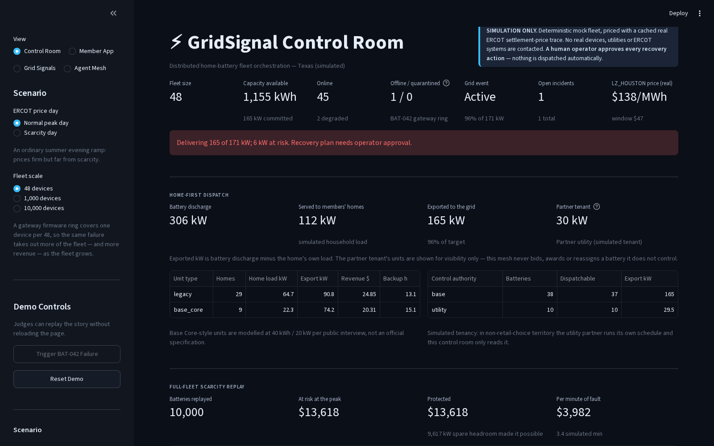
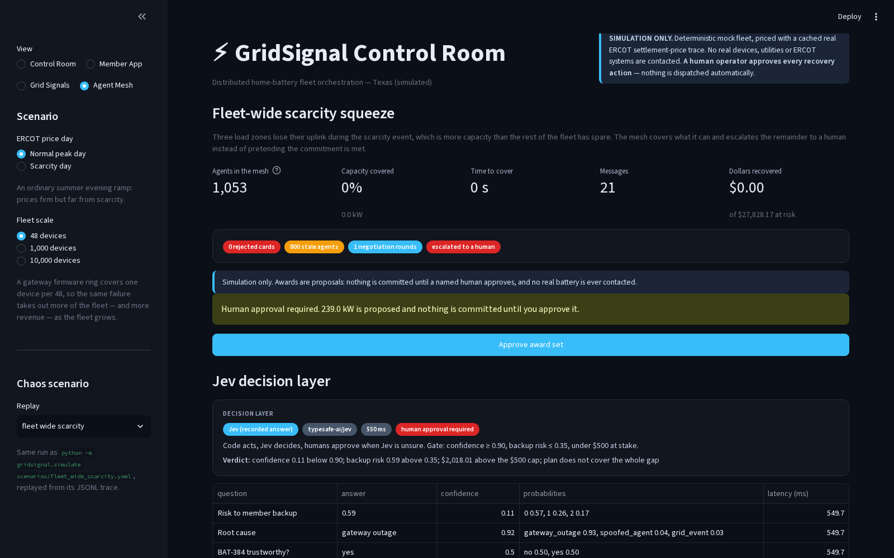
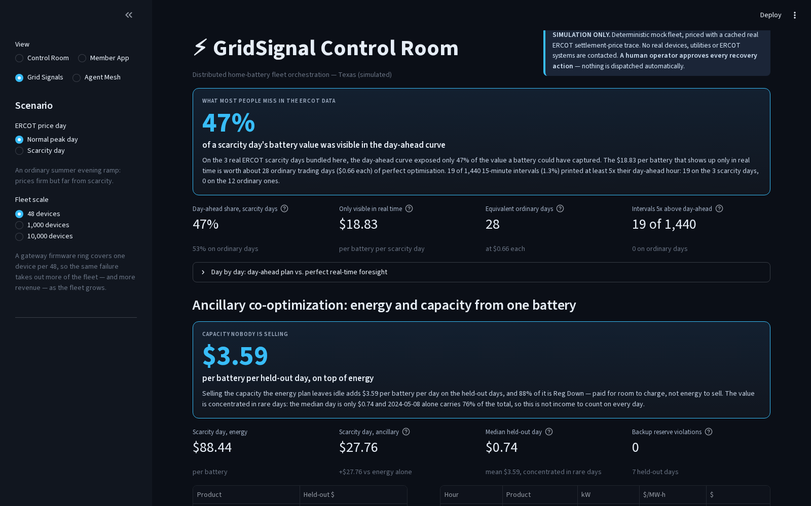
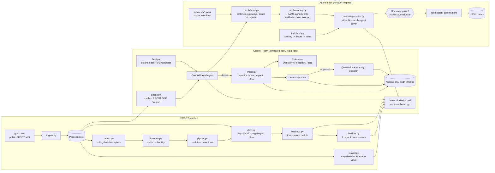

# GridSignal

Turning ERCOT grid data into battery dispatch signals that Base Power members can act on —
plus **GridSignal Control Room**, a simulation-only operator view that keeps a distributed
home-battery fleet coordinated when a device fails.

Built at the Base Power x AITX Talent Hackathon, Austin, Sep 25 to 27, 2026.

**Tracks:** Orchestration (Control Room) + Open Grid Data

> **Simulation only.** The fleet, the failure and the recovery are deterministic local mock data;
> only the ERCOT settlement prices are real (a cached public price trace). It does not connect to
> real devices, utilities, ERCOT operational systems or any control plane, and it never dispatches
> anything. A human operator must approve every recovery action.

## Problem

A home-battery fleet is only worth what it can reliably deliver during a grid event. When a single
device goes dark mid-event, the operator has to notice it, understand what it costs the fleet's
commitment, decide what to do, and coordinate engineers and field techs — usually across dashboards,
chat and spreadsheets, under time pressure.

## Solution

GridSignal Control Room closes that loop in one screen: telemetry loss becomes a typed incident with
a root-cause hypothesis and quantified impact, the orchestrator proposes a recovery plan and fans out
role-specific tasks, **a human approves**, and only then is the failed device quarantined and its
committed kW reassigned across healthy headroom — with an immutable audit timeline of the whole
sequence.

The impact is priced against **real ERCOT data**: the grid event sits on the most expensive
two-hour window of a real LZ_HOUSTON trading day, so the incident shows dollars at risk
(`kW x hours x $/MWh`) before approval and dollars recovered after it.

Two dials in the sidebar make that number mean something at Base's scale:

- **Price scenario** — a normal peak day (2026-09-22, peak $199.74/MWh) or a real ERCOT
  scarcity day (2023-09-06, peak $5,147.65/MWh, settlement at the offer cap plus reserve adders).
- **Fleet scale** — 48, 1,000 or 10,000 simulated devices. The failure is a gateway firmware
  ring that covers one device in 48, so a 10,000-device fleet loses 208 devices to the same
  root cause. On the scarcity day that is **$8,971 at risk and $8,683 recovered** from one
  operator approval, versus $1.82 on the 48-device normal day.

## Why this matters to Base

Base Power sells homeowners a battery and sells the grid the fleet those batteries add up to. Both
promises break in the same place: a device that stops answering during the two hours that pay for
the year. This repo is built around that minute.

- **The commitment survives the failure.** A lost device is detected, priced, quarantined and its
  kW reassigned across healthy headroom, with the member's backup reserve protected. On the
  bundled scarcity day one operator approval is the difference between $8,971 at risk and $8,683
  recovered across 10,000 devices.
- **A person still signs.** Nothing dispatches without a named human approval, and the whole
  sequence lands in an append-only audit timeline — the shape a utility-facing operation has to
  have before it can be trusted with real hardware.
- **It scales to the fleet Base is building, not the one in the demo.** 10,000 devices detect and
  reallocate in ~138 ms, and 10,000 agents negotiate in ~370 ms.
- **The homeowner is a first-class view.** The same event rendered as backup hours and dollars
  earned, with no incident IDs — the support conversation, not the ops console.
- **The market read is honest.** The dispatch policy is scored on real ERCOT days it was never
  tuned on, losing days included, because a number Base cannot reproduce is worth nothing to Base.

## Quick Start

One command starts the demo from a fresh clone (after install):

```bash
git clone https://github.com/Regantih/gridsignal.git
cd gridsignal
python3.11 -m venv .venv && source .venv/bin/activate
pip install -e ".[dev]"
streamlit run app/dashboard.py     # -> http://localhost:8501
```

Requires Python 3.11 or newer. No API keys, accounts or network access are required: the ERCOT
price traces and the recorded Jev answers are bundled in the repo.

### Environment variables (all optional)

Copy [`.env.example`](.env.example) to `.env` only if you want a live path; every variable is
optional and the app runs fully offline without any of them.

| Variable | Used for | Without it |
|---|---|---|
| `AI_GATEWAY_API_KEY` | Jev via Vercel AI Gateway (`POST /v1/evaluate`, model `typesafe-ai/jev`) | Recorded Jev answers replay from `data/jev_fixtures/`; then deterministic rules, labelled "Jev offline, rules fallback" |
| `TYPESAFE_API_KEY` | Jev direct (`POST /v1/systemone`, model `jev-latest`) | as above |
| `ERCOT_API_USERNAME` / `ERCOT_API_PASSWORD` / `ERCOT_API_SUBSCRIPTION_KEY` | Only if you swap `gridstatus` for ERCOT's official API | `gridstatus` reads the same public reports with no credentials |
| `DEFAULT_ZONE` | Load zone for refreshes | `LZ_HOUSTON` |

No key is ever written to a fixture, trace, log or commit.

Refresh the cached prices from ERCOT's public MIS reports (needs the `[ercot]` extra and network,
still no credentials):

```bash
python -m gridsignal.ingest --date 2026-09-22          # LZ_HOUSTON real-time 15-min SPP
python -m gridsignal.ingest --scarcity-year 2023       # highest-priced day of that year
```

## Tests and formatting

```bash
pytest -q          # failure -> incident -> approval -> recovery state flow
ruff check .
ruff format --check .
```

## Using the dashboard

The sidebar **View** switch picks between the four pages:

### Control Room

- **Trigger BAT-042 Failure** (sidebar) — simulate the telemetry blackout.
- **Approve Recovery Plan** (incident panel) — the human gate; nothing moves until it is clicked.
- **Reset Demo** (sidebar) — replay the story without reloading the browser.
- **Price scenario / Fleet scale** (sidebar) — switch between the normal and scarcity ERCOT days
  and between 48, 1,000 and 10,000 devices; either rebuilds the simulation from its stable state.
- **Congestion dispatch preference** (incident column) — discharge one zone's batteries to their
  headroom first, ordered by the bundled ERCOT basis; the target, the member reserve and the
  approval gate are unchanged, and the choice is written to the audit log.
- **Home-first dispatch** (panel under the overview) — every battery serves its own simulated
  household load out of storage first and exports only the surplus, so
  `export kW = discharge kW − home load kW`. The panel splits total discharge into what members'
  homes took and what reached the grid, and breaks both down by unit type and by tenant.
- **Member reserve floor** (panel below the map) — raise the reserve before a forecast storm and
  the panel prices the trade: kW no longer exported, the revenue given up over the event window,
  and the backup hours that buys. Applying it reallocates the fleet and writes a `reserve_policy`
  entry to the audit log.

#### Spare capacity: offered, or held for a named reason

A fleet that covers its event target and then sits on tens of MW of idle inverter is leaving
money on the table, so the Control Room accounts for **every** spare kW. The **Spare capacity**
panel offers the headroom that is left after the member reserve and the existing commitments,
and lists what it holds back and why: member backup reserve, energy serving the member's own
home, offline/degraded units, another tenant's batteries, a simulated feeder export cap
(`DELIVERABILITY_KW_PER_DEVICE = 6 kW` per operator-controlled unit, a modelling assumption),
or a price below the cycle-wear floor. Offering it writes a `surplus_offered` entry to the audit
log; holding it writes `surplus_held` with the reasons.

On the bundled scarcity window at **$138.39/MWh over 2.00 h**, one command
(`python -m gridsignal.surplus`) reports:

| Simulated fleet | Event target | Offered on top | Simulated revenue | After modelled wear |
|---|---:|---:|---:|---:|
| 48 devices | 171 kW | 46 kW | $12.69 | $12.23 |
| 10,000 devices | 36,000 kW | 9,425 kW | $2,608.63 | $2,514.38 |

At 10,000 devices the held-back blocks are 24,500 kW of member backup reserve, 19,329 kW serving
members' own homes and 21,330 kW of the partner utility's tenant — no unexplained idle capacity.
Prices are real cached ERCOT prints; the fleet, the feeder cap and the wear cost are simulated.
Tests: `tests/test_control_room.py` (offer, named reasons, reserve floor after offering, a cheap
window held with the price named, and the per-zone feeder cap).

#### Mixed fleet and control authority (simulated)

The fleet is a blend of legacy units and **Base Core-style units (40 kWh, 20 kW inverter)**.
Capacity and inverter power live on each agent card, and the Control Room reports revenue,
export and backup hours by unit type. Those Base Core numbers are taken from a public interview
with Base's COO and are **simulated, not official specifications**.

Each card also names who controls the battery: **Base** (retail-choice markets) or a **utility
partner** (non-retail-choice markets, where the battery is owned by Base but dispatched by the
utility). `LZ_WEST` is modelled as the partner's territory. The mesh never bids, awards or
reassigns a battery it does not control — utility units follow the partner's own dispatch
schedule, appear as a separate tenant in the Control Room, and are excluded from incident
cohorts and recovery, including during the chaos drills
(`tests/test_home.py::test_the_operator_never_dispatches_another_tenants_battery`).

### Member App

The same incident seen from one house, deliberately kept separate from the operator tooling:
hours of whole-home backup still held in reserve, how much of the discharge is powering the house
versus exported to the grid, the dollars the battery earned in the event and the dollars it helped
protect when a neighbour dropped out, plus a plain-English notice about the device issue and its
resolution. Pick any home in the sidebar; BAT-042 is the one that fails.
Trigger the failure from the Control Room (or the sidebar controls on this page) and the member
copy moves from "Your battery is healthy" to "We've lost contact with your battery" to
"Resolved" — with no incident IDs, kW targets or approval controls exposed to the homeowner.

Member-facing numbers use two explicit assumptions: a **1.2 kW essential household load** for
backup hours and a **60% member revenue share** of the grid value their battery creates. Neither
is a Base Power tariff. The UI says **members**, not customers.

Two further member features, both simulated:

- **Generator top-off.** Members who own a small portable generator (optional per member) see the
  extra kWh and the extra backup hours it buys during a long outage, counted only while it has
  fuel.
- **Neighbour mutual aid.** During a neighbourhood island, members who opt in can send a little
  surplus to an opted-in neighbour flagged as running a medical device. A share is only ever taken
  from energy a giver holds **above their own reserve**, and the card shows who is sending what
  and the backup hours it adds for the recipient. Nothing moves until both members confirm.
  `tests/test_home.py::test_mutual_aid_helps_a_medical_member_without_spending_anyone_else_reserve`
  proves no sharing member ever drops below reserve.

### Grid Signals

An offline analytics view over the same bundled ERCOT day. The policy is **day-ahead anchored**:
charge and export windows are planned from the ERCOT DAM curve for that trade date — published
the afternoon before, so planning from it is not lookahead — and the real-time spike detector
only overrides the plan where real time has diverged from it (sell into a spike the day-ahead
curve never priced, refuse to buy a spike, wait out a dud export). Signals are advisory; nothing
is dispatched.

The headline shows two numbers side by side and never the first one alone: the scenario day at
the selected fleet scale ($65,500/day across 10,000 batteries on the 2023-09-06 scarcity day) and
the **held-out record** — mean +$0.44, median +$0.26 per battery per day, beating the naive
schedule on 6 of 7 days it was never tuned on (see
[Held-out results](#held-out-results-out-of-sample)). The scarcity day is the least
representative day in the set; the held-out average is the honest claim.

Same numbers from the CLI:

```bash
python -m gridsignal.pipeline --scenario scarcity --devices 10000
python -m gridsignal.holdout          # the held-out scorecard
```

The view opens on the **Open Grid Data insight card** (below), then the backtest headline, the
signal chart, the held-out scorecard and the **congestion panel** — a zone-by-hour basis heatmap,
the West-to-load-center spread, zone-timed against zone-blind value per battery, and the "where
to install next" placement sketch ([Congestion](#open-grid-data-congestion-and-where-the-next-battery-is-worth-most)).

Full walkthrough, safety boundaries and the timed 5-minute demo script:
[`docs/DEMO.md`](docs/DEMO.md).

### Agent Mesh

The orchestration layer, run as a mesh of agents instead of a single controller. Every battery,
gateway ring and load zone registers an **AgentFacts-style capability card** (id, kW and kWh
available, state of charge, zone, health, last heartbeat) signed with an HMAC key the registry
generates at startup. When capacity is lost, a **Coordinator** broadcasts a call for capacity,
healthy agents bid their spare kW at a price that reflects battery wear and how much of the
homeowner's backup reserve they would be giving up, and the coordinator awards the cheapest set
that covers the gap — as a *proposal*. Nothing is committed until a named human approves, and a
repeat trigger or a double-click on approve returns the award already on file rather than
committing the capacity twice. When the remaining headroom cannot cover the commitment the mesh
covers what it can and escalates the rest to a person.

The view shows the registry with each card marked **verified / stale / rejected** (a card edited
after signing fails verification; an agent that stops sending heartbeats goes stale, and neither
can win an award), the full message log of calls, bids, awards, approvals and escalations, and a
picker that replays any bundled chaos scenario.

Scenarios are YAML, in the spirit of NANDA Town's agent-town runs, and replay deterministically:

```bash
python -m gridsignal.simulate scenarios/zone_outage.yaml   # writes data/traces/zone_outage.jsonl
python -m gridsignal.simulate --all
```

| Scenario | What it injects | Result |
|---|---|---|
| `scenarios/single_device.yaml` | BAT-042 goes dark, 48 agents | 100% covered after one human approval |
| `scenarios/zone_outage.yaml` | whole LZ_HOUSTON gateway outage, 1,000 agents | partial cover, remainder escalated |
| `scenarios/lying_agent.yaml` | gateway ring outage + an agent that edits its card to claim 500 kW + silent telemetry | forged card rejected, silent agents stale, gap covered by the rest |
| `scenarios/silent_bidder.yaml` | two devices fail, then a winning bidder stops answering | its kW returns to the gap and a second round runs, also human-approved |
| `scenarios/fleet_wide_scarcity.yaml` | four zones lost during the scarcity event | more than the fleet can cover: partial commit and escalation |

Each run writes a JSONL trace (one message per line) and reports time to cover, percent of the
commitment covered, messages sent, and dollars at risk versus recovered. Everything is arithmetic
on the seeded fleet: no LLM, no API key, no network. An optional LLM coordinator
(`src/gridsignal/mesh/llm.py`) can rank bids behind an explicit flag; it is **off by default** and
falls back to the deterministic ranking when no provider is wired up.

### Firmware rollout and install wave (Agent Mesh → Rollout panel)

A fleet is also a software deployment target: the same orchestration that reassigns kW has to ship
a build to thousands of devices without breaking the commitment. The rollout job runs the fleet in
rings — **lab (5 devices) → 1% canary → 10% → 50% → 100%** — and each ring has to clear three
gates before the next opens: **telemetry heartbeat**, **charge/discharge response**, and
**backup reserve held**. A ring never advances while a simulated grid event is live or while a home
in that ring is islanded; it waits, and gives up rather than shipping into the event. Every
promotion past 10% of the fleet needs a named human, so the two largest rings stop until someone
approves them. On the first failed gate the job halts and rolls the whole touched population back
to the previous build.

```bash
python -m gridsignal.rollout scenarios/rollout_bad_build.yaml   # writes data/traces/rollout_bad_build.jsonl
python -m gridsignal.rollout scenarios/rollout_good_build.yaml
python -m gridsignal.install scenarios/install_wave.yaml        # writes data/traces/install_wave.jsonl
```

| Run | Scale | Result |
|---|---|---|
| `rollout_good_build.yaml` | 10,000 simulated devices | all 5 rings, 2 human approvals, 10,000 homes updated, 0 reserve violations |
| `rollout_bad_build.yaml` | 10,000 simulated devices | halted in the 1% canary on `charge_discharge_response` **420 simulated seconds** after the first device updated; **100 homes touched, 3 affected, 100 rolled back**, 0 reserve violations |

The bad build is the interesting one: it fails *silently*, only on devices above a simulated 35 °C,
and the heartbeat keeps arriving the whole time. A heartbeat-only gate would have passed it
straight through to 10,000 homes; the charge/discharge gate catches it inside the first hundred.

The **install wave** is the other direction — units arriving rather than software leaving. Several
hundred newly installed batteries join the mesh *during* an active event. Each one is commissioned
by a simulated installer phone check that registers its signed card; a unit that never went through
that check carries no valid signature and is rejected at the door. An accepted unit starts in
**probation**, advertising zero biddable kW, and becomes eligible only after it clears the same
three health gates. In the bundled wave: 400 units arrive, 390 register, 10 are rejected, 383 clear
probation at ~95 joins/h simulated, the first eligible award lands 300 s after the first arrival,
and **zero kW is awarded to an unverified or probationary unit** while **no existing commitment
loses a single kW**. Awarded agents republish what they have *left*, so the same kW is never bid
twice.

All of it is simulated: no firmware, no installer, no device and no temperature in these scenarios
is real, and nothing is ever sent to a battery.

### Jev, the decision layer

*Code acts, Jev decides, humans approve when Jev is unsure.* The mesh does the arithmetic; the
decisions that need judgement are put to [Jev](https://docs.typesafe.ai/api), TypeSafe AI's
decision model, as four explicit questions over the incident snapshot (agent cards, telemetry
ages, prices, bids, plan coverage):

1. **Root cause**, as a choice between device fault, gateway outage, telemetry lag, spoofed agent
   and grid event.
2. **Is this card or bid trustworthy?**, asked *alongside* the HMAC check, not instead of it — the
   signature catches an edited card, this catches an agent that is validly signed and still
   behaving oddly.
3. **Risk to the homeowner's backup**, as a 0–1 score.
4. **A confidence-gated approval policy**: a step is auto-approved only when every answer is at
   least the confidence threshold (default `0.9`), backup risk is low (≤ 0.35), the dollars at
   stake are under a cap (default $500) and the plan covers the whole gap and flags nobody as
   untrustworthy. Anything else routes to the same human approval gate as before, with Jev's
   probabilities shown next to the button. `Coordinator.approve()` remains the only commit path.

Two transports sit behind one client and whichever key is set wins — Vercel AI Gateway
(`AI_GATEWAY_API_KEY`, `POST /v1/evaluate`, model `typesafe-ai/jev`, yes/no questions typed
`boolean`) or TypeSafe direct (`TYPESAFE_API_KEY`, `POST /v1/systemone`, model `jev-latest`,
typed `noul`). Both normalise to one internal answer shape. Only simulated fleet state is sent;
keys are read from the environment and never written to fixtures, traces or logs.

**Judges will not have a key, and they do not need one.** Real Jev answers for every bundled
scenario are recorded in `data/jev_fixtures/*.json` with the model version and timestamp and are
replayed offline. With no fixture and no key the mesh falls back to deterministic rules and says
so: **Jev offline, rules fallback**. The default run and the whole test suite pass with no key
and no network.

```bash
python -m gridsignal.jev.evaluate          # rules-only vs Jev, from the recorded answers
python -m gridsignal.jev.record --refresh  # re-record, only if a key is set
```

| Decision layer | Root-cause accuracy | Human approvals | Auto-approvals | Median decision latency |
| --- | --- | --- | --- | --- |
| rules-only | 5/5 (100%) | 6 | 0 | 0 ms |
| jev | 3/5 (60%) | 6 | 0 | 326 ms |

| Scenario | Injected root cause | rules-only | Jev |
| --- | --- | --- | --- |
| `fleet_wide_scarcity` | gateway_outage | gateway_outage ✓ | gateway_outage ✓ |
| `lying_agent` | gateway_outage | gateway_outage ✓ | spoofed_agent ✗ |
| `silent_bidder` | device_fault | device_fault ✓ | telemetry_lag ✗ |
| `single_device` | device_fault | device_fault ✓ | device_fault ✓ |
| `zone_outage` | gateway_outage | gateway_outage ✓ | gateway_outage ✓ |

Read that honestly. The rules were written against these same five injections, so their 5/5 is a
ceiling, not evidence they generalise; Jev sees the state cold and gets 3 of 5, missing the two
scenarios that stack injections (`lying_agent` is a gateway outage *with* a forged card, and it
names the forgery; `silent_bidder` is two dead devices *and* stale telemetry, and it names the
staleness). Both are defensible readings of the state and both are wrong about the cause of the
lost kW. Jev also never cleared the 0.9 gate on any bundled scenario, so **every** award in the
demo is still approved by a person — the auto-approval path is exercised by tests, not by the
demo. Latency is the recorded live round trip (median 326 ms); the rules answer in microseconds.

### Held-out chaos drills (written after the rules were frozen)

The five scenarios above are the ones the detection rules and the Jev questions were written
against. These four drills were written afterwards, from published accounts of how real grids
fail, and scored **once** with no change to a detection rule, the recovery logic or a Jev
question. Both results are below: the frozen baseline first, then the re-scored run after the
logic was changed in response to it. **Every frequency, outage, load-ramp and islanding value
here is simulated** — this is
a simulator, not a reproduction of any real event and not a grid-control system.

```bash
python -m gridsignal.drills   # rules-only vs Jev on scenarios/holdout/*.yaml
```

#### Baseline: scored once, before anything was changed

| Decision layer | Root-cause accuracy on held-out drills |
| --- | --- |
| rules-only | 0/4 |
| Jev | 1/4 |

| Drill | Injected root cause | rules-only | Jev | kW recovered | Time to recover | Backup reserve violations | Response (cycles) |
| --- | --- | --- | --- | --- | --- | --- | --- |
| `cascade_spain_style` | grid_event | gateway_outage ✗ | gateway_outage ✗ | 909 of 1,099 kW (83%) | 195s | 0 | n/a |
| `frequency_dip_coordinator_down` | grid_event | device_fault ✗ | grid_event ✓ | 600 of 600 kW (100%) | 225s | 0 | 12,900 (over 15) |
| `large_load_squeeze` | grid_event | device_fault ✗ | spoofed_agent ✗ | 965 of 1,207 kW (80%) | 120s | 0 | n/a |
| `neighborhood_island` | gateway_outage | device_fault ✗ | grid_event ✗ | 768 of 1,010 kW (76%) | 75s | 0 | n/a |

#### After tuning on held-out

The baseline above is what the system scored before it was touched. Three changes were then made
in response to it, and the drills re-scored. These numbers are **after tuning on held-out**, so
read them as a repair of known weaknesses, not as evidence of generalisation:

1. **A local rule on every card.** Each battery's signed card now carries `ffr_kw` (a quarter of
   its spare power, always above the homeowner reserve) and `ffr_trigger_hz`. On a simulated
   crossing of 59.85 Hz each battery deploys that pledge itself, with no coordinator in the
   loop, at an assumed 12-cycle local latency. The deployed kW is booked as a commitment and the
   card is republished, so the auction cannot sell it twice; when the coordinator returns it is
   told what was already deployed and auctions only the remainder.
2. **Grid-side conditions in the state.** The snapshot now carries simulated frequency, the kW
   attributable to grid-side events versus component failures, islanded homes and self-deployed
   kW — but only when a drill has them, so a plain component failure sends Jev exactly the state
   it always did and the tuned-five results are unchanged.
3. **Two rules that read them.** If grid-side events explain at least half of the missing kW,
   the cause is the grid; if healthy homes are islanded together, the cause is distribution, not
   the batteries.

The table below was re-scored again after the external-review fix that made the mesh hold back
the *same* member reserve the Control Room holds (`reserve_kwh` per member, not a flat 4 kWh
floor), which changes every bid and therefore every state Jev is asked about; the Jev answers
were re-recorded against the new state. Reproduce with `python -m gridsignal.drills`.

| Decision layer | Root-cause accuracy (after tuning on held-out, re-scored after the reserve fix) |
| --- | --- |
| rules-only | 4/4 |
| Jev | 2/4 |

| Drill | Injected root cause | rules-only | Jev | kW recovered | Time to recover | Backup reserve violations | Self-deployed locally | Response (cycles) |
| --- | --- | --- | --- | --- | --- | --- | --- | --- |
| `cascade_spain_style` | grid_event | grid_event ✓ | gateway_outage ✗ | 947 of 1,039 kW (91%) | 195s | 0 | 0 kW | n/a |
| `frequency_dip_coordinator_down` | grid_event | grid_event ✓ | grid_event ✓ | 600 of 600 kW (100%) | 225s | 0 | 245 kW | 12 (within 15) |
| `large_load_squeeze` | grid_event | grid_event ✓ | grid_event ✓ | 979 of 1,206 kW (81%) | 120s | 0 | 0 kW | n/a |
| `neighborhood_island` | gateway_outage | gateway_outage ✓ | grid_event ✗ | 739 of 887 kW (83%) | 75s | 0 | 0 kW | n/a |

What moved and what did not: the rules went 0/4 → 4/4, and the frequency drill now answers in
**12 simulated cycles** with 245 kW deployed from the cards themselves before the coordinator is
back, then covers the remainder at 225 s once it is — the same 600 kW, counted once.
Jev moved 1/4 → 2/4 on answers re-recorded against the post-reserve-fix state, and its per-drill
answers moved around in both directions, so the fair reading is still that the deterministic
rules, not the model, are what improved. Backup reserve violations stayed at **zero** in every
drill, before and after, and nothing was auto-approved either way.

What each drill injects, and what the numbers say:

- **`cascade_spain_style`** — a simulated generation trip that drops frequency to 59.88 Hz, then
  two gateway losses and a six-device stale-telemetry wave, arriving in waves 30–150 s apart so
  the faults interact. Compound, cascading failure is the shape the ENTSO-E report on the
  28 April 2025 Iberian blackout describes — many interacting factors rather than one cause
  ([entsoe.eu](https://www.entsoe.eu/publications/blackout/28-april-2025-iberian-blackout/)).
  That report is context for the *shape* of the drill only; nothing here reproduces that event,
  its causes or its data. At baseline both layers called it a gateway outage — the loudest
  signal in the snapshot, not the thing that started it; after tuning the rules weigh the
  900 kW that went missing on the grid side against the 199 kW of gateway losses and name the
  grid. Jev still says gateway outage.
- **`frequency_dip_coordinator_down`** — a simulated under-frequency event crossing 59.85 Hz
  while the coordinator is unreachable for 180 s. The 59.85 Hz trigger and the 15-cycle response
  window are borrowed as *concepts* from ERCOT's Fast Frequency Response description
  ([ERCOT Real-Time Market Operations, Sep 2025](https://www.ercot.com/files/docs/2025/09/22/2026_09-Real-Time-Market-Operations.pdf));
  no ERCOT frequency data is used and nothing is dispatched. The baseline result is the honest
  one: the fleet covered the full 600 kW gap but only **after the coordinator returned**, at
  ~12,900 simulated cycles against a 15-cycle concept, because the cards carried no local rule.
  After tuning on held-out they do, and the first 245 kW lands in 12 simulated cycles.
- **`neighborhood_island`** — a simulated distribution outage where 200 LZ_AUSTIN homes island on
  their own batteries. The islanded homes are never bid or awarded, so the mesh protects
  homeowner backup over export revenue: **zero reserve violations**, 83% of the gap covered by
  the rest of the fleet and the remainder escalated. Ten simulated minutes later the feeder is
  restored and those homes resync and republish their cards; nothing has to be unwound, because
  their stored energy was never sold.
- **`large_load_squeeze`** — a simulated 1,200 kW data-center-style ramp on top of a device
  fault, while three validly signed agents publish conflicting inflated capacity. Jev calls it a
  spoofed agent at baseline; the HMAC check does not, because the cards really are signed, and
  after tuning the rules call it a grid event because the ramp is 99% of the missing kW. 81% covered,
  escalated, no reserve spent.

Across all four drills, in both the baseline and the tuned run, the fleet spent **zero**
homeowner backup reserve and auto-approved **nothing** — every award went through the human
gate. That is the part that held from the start. Root-cause naming did not: 0/4 for the rules,
1/4 for Jev at baseline. Both layers reach for the injection they were
shown before rather than "the grid itself moved", which is exactly what a held-out set is for.
Those are the baseline numbers, scored before any change. The *after tuning on held-out* table
above shows what changed once the logic was repaired, and is labelled as such throughout.

**Inspiration and attribution.** The agent-card, registry and agent-town-scenario ideas are
inspired by MIT Project NANDA — [nandatown.projectnanda.org](https://nandatown.projectnanda.org)
and [github.com/projnanda](https://github.com/projnanda). No NANDA code is vendored, copied or
depended on here; the registry, the signing scheme, the contract-net protocol and the scenario
format in this repo are original implementations of those ideas against this simulated fleet.

## Open Grid Data: what the day-ahead curve does not tell you

The usual read of ERCOT scarcity is "the spikes are where the money is". The bundled data says
something sharper, and it is the thing most people miss: **on the three real scarcity days in this
repo, only 47% of the value a battery could have captured was visible in the day-ahead curve**.
The other **$18.83 per battery per scarcity day** exists only in the real-time prints — worth about
28 whole ordinary trading days ($0.66 each) of perfect optimisation. 19 of 1,440 15-minute
intervals (1.3%) settled at 5x or more above their day-ahead hour, and **all 19 fell on scarcity
days**; the twelve ordinary days never diverged once.

The operational consequence for a fleet is specific: a day-ahead schedule is enough on an ordinary
day (53% of the value is already in the curve, and nothing surprises you), but on a scarcity day
the schedule is roughly a coin flip against what the day actually paid — so the real-time layer,
and the ability to keep the fleet coordinated while it runs, is where the scarcity money lives.
That is the same minute a device failure costs the most, which is why the two tracks in this repo
are one product.

**Method, so it can be checked.** For each bundled day, two plans settle the *same* real
15-minute LZ_HOUSTON prints on one 13.5 kWh / 5 kW battery: (a) charge and export windows chosen
from that date's ERCOT day-ahead curve alone, executed blind; (b) the best single charge/discharge
cycle that would have been possible knowing the real-time prices — a ceiling nobody can trade, not
a strategy. "Visible" is (a) ÷ (b), value-weighted across days so a $0.20 day cannot outvote a
$50 one. A day counts as scarcity if it peaked above $1,000/MWh (3 of 15 days). Code:
[`src/gridsignal/insight.py`](src/gridsignal/insight.py), tests: `tests/test_insight.py`,
reproduce with:

```bash
python -m gridsignal.insight
```

This is a statement about 15 real LZ_HOUSTON days, not about ERCOT in general, and the foresight
ceiling is one cycle per day — a two-cycle battery would move both columns.

## Open Grid Data: congestion, and where the next battery is worth most

A second read of the same days, this time across space instead of time. West Texas generates;
Houston, Dallas, Austin and San Antonio consume; when the lines between them bind, the same
15-minute interval settles at different prices in different zones. The bundled set now carries
**all eight ERCOT load zones plus the hub average** for every one of the 15 trade dates, so the
spread can be measured rather than asserted.

Two spreads, per 15-minute interval, per zone:

- **zone-to-hub basis** = zone SPP − `HB_HUBAVG` SPP — what a zone paid over the system reference.
- **West-to-load-center spread** = load-zone SPP − `LZ_WEST` SPP — what a metro paid over the
  generation-heavy west, which is the direction congestion pushes.

**Every dollar figure in this section is hindsight-timed**: the discharge hours are ranked on
prices that had already settled, so they are ceilings on perfect timing in a zone, not what a
live policy earned. The causal policy is the held-out scorecard above.

**What most people miss:** across these 15 bundled days, **LZ_LCRA at hour 18 priced $39.82/MWh
above the hub average on average**, and **3,427 of 11,520 zone-intervals (29.8%) settled more than
$5/MWh away from the hub** — yet a battery *in LZ_LCRA* timed to its own zone's price earned only
**+$0.15 per battery per day** (hindsight-timed) over the same battery timed to the hub. The gap
and the uplift quoted next to it are the same zone; the best zone on these days is a different
one, `LZ_SOUTH` at +$0.57. The congestion is large and real; the share of it a single 13.5 kWh
battery can collect by re-timing alone is small. Both halves are in the Grid Signals panel.

| Zone | Metro | Zone-timed $/bat/day | Zone-blind $/bat/day | Uplift $ | Ordinary days $ | Scarcity days $ | Mean basis $/MWh | Days won |
|---|---|---:|---:|---:|---:|---:|---:|---|
| LZ_SOUTH | South Texas | 7.01 | 6.44 | **+0.57** | +0.70 | +0.03 | −1.62 | 11/15 |
| LZ_LCRA | Austin (LCRA) | 7.47 | 7.32 | **+0.15** | +0.18 | +0.03 | 6.25 | 10/15 |
| LZ_HOUSTON | Houston | 7.29 | 7.21 | **+0.08** | +0.09 | +0.04 | 2.57 | 11/15 |
| LZ_AEN | Austin (city) | 7.35 | 7.27 | **+0.08** | +0.09 | +0.03 | 3.72 | 11/15 |
| LZ_NORTH | Dallas-Fort Worth | 7.35 | 7.28 | **+0.07** | +0.09 | +0.01 | 2.61 | 9/15 |
| LZ_RAYBN | Rayburn | 7.32 | 7.25 | **+0.07** | +0.09 | +0.01 | 1.48 | 8/15 |
| LZ_CPS | San Antonio | 7.32 | 7.26 | **+0.06** | +0.06 | +0.04 | 3.11 | 11/15 |
| LZ_WEST | West Texas | 7.37 | 7.38 | **−0.01** | +0.01 | −0.06 | 9.49 | 8/15 |

All figures hindsight-timed. **Ordinary and scarcity days are split** because their averages are
nothing alike: 12 of the 15 bundled days are ordinary, 3 touched four figures, and re-timing
collects almost nothing on the scarcity days — on those days every zone is expensive at once, so
the local signal and the hub signal pick nearly the same hours.

**Method.** Both policies settle at the *same* local zone prints on the same 13.5 kWh / 5 kW
battery; the only difference is which price series ranks the intervals — the zone's own price
(zone-timed) or `HB_HUBAVG` (zone-blind). So the number isolates the value of the local signal,
not of a better location. Code: [`src/gridsignal/congestion.py`](src/gridsignal/congestion.py),
tests: `tests/test_congestion.py`, reproduce with `python -m gridsignal.congestion`.

**Where to install next (data-driven sketch, not a forecast).** The panel ranks zones by grid
value per battery on these days and places the next N batteries (default 1,000) greedily, 100 at
a time, with each zone's marginal value falling linearly toward a saturation count derived from
its positive mean basis (`RELIEF_MW_PER_DOLLAR = 8 MW per $/MWh of basis`, an explicit modelling
assumption, not a measured relationship). It is a sketch on 15 days of prices — not a siting
study, not a forecast, and it models no interconnection, land, permitting or network constraint.

**Zone-aware dispatch.** The Control Room has a congestion dispatch preference: pick a zone and
its batteries are filled to their headroom before the rest of the fleet shares what is left. The
target, the homeowner reserve and the human approval gate do not move — only the order. The zone
ordering comes from the bundled basis (`congestion.dispatch_order`); the simulated `LZ_AUSTIN`
fleet zone settles against `LZ_AEN` via `fleet.settlement_zone`.

## Benchmarks

Measured on this machine (Python 3.11, single process, no GPU); reproduce with
`pytest -q -s tests/test_scale.py tests/test_simulate.py`.

| Benchmark | Scale | Result |
|---|---|---|
| Control Room: build fleet | 10,000 devices | ~104 ms |
| Control Room: detect failure | 10,000 devices | ~1 ms |
| Control Room: approve + reallocate | 10,000 devices | ~33 ms |
| Mesh: register signed cards | 10,000 agents | ~242 ms |
| Mesh: heartbeat sweep | 10,000 agents | ~106 ms |
| Mesh: contract-net negotiation | 10,000 agents, 5,913 bids | ~22 ms |
| Rollout: staged rings + gates | 10,000 devices | ~2 ms (bad build caught after 420 s simulated) |
| Install wave: commission + probation + re-auction | 400 units joining 10,000 | ~600 ms |
| Grid Signals: full pipeline for one day | 96 intervals | < 1 s |
| Jev decision round trip | recorded live median | 326 ms (rules fallback: microseconds) |

## Deploying to Streamlit Community Cloud

The app is deploy-ready as-is: everything it needs is committed, so it runs on a free Community
Cloud instance with no secrets.

1. Push this repo to GitHub (or fork it).
2. Go to [share.streamlit.io](https://share.streamlit.io), **Create app → Deploy a public app from
   GitHub**.
3. Repository `Regantih/gridsignal`, branch `main`, **Main file path** `app/dashboard.py`.
4. **Advanced settings → Python version 3.11**. Dependencies are read from `requirements.txt`
   (a pinned mirror of the runtime dependencies in `pyproject.toml`).
5. Deploy. No secrets are required. To exercise a live Jev path instead of the recorded answers,
   add `AI_GATEWAY_API_KEY` or `TYPESAFE_API_KEY` under **Settings → Secrets**.

If the deployed URL is unavailable, the scripted capture below produces the same walkthrough as a
video.

## Screen capture (deploy fallback)

```bash
pip install -e ".[capture]"
python -m playwright install chromium
python scripts/capture_demo.py          # writes docs/media/*.png, demo.webm and demo.mp4
```

It starts the dashboard on a free port, walks Control Room → trigger → approve → Agent Mesh →
Grid Signals → Member App, screenshots each step and records the session. No credentials, no
network. The committed output is in [`docs/media/`](docs/media): the eight stills and
[`demo.mp4`](docs/media/demo.mp4).

| Control Room, BAT-042 down | Agent Mesh | Grid Signals insight |
|---|---|---|
|  |  |  |

## Tech Stack and Architecture

- Python 3.11, Streamlit, Plotly, pandas
- `gridstatus` + scikit-learn only for refreshing ERCOT data and the optional pipeline
  (`.[ercot]` extra)
- Control Room state lives in memory; ERCOT prices are cached as Parquet in `data/processed/`



Jev is one input to the mesh, never the authority: an HMAC signature decides whether a card is
admissible, deterministic rules price and select the bids, Jev adds a judgement on cause, trust and
homeowner risk with a confidence, and a human approves. With no key and no fixture the mesh runs
unchanged on the rules.

| Module | Responsibility |
|---|---|
| `src/gridsignal/fleet.py` | Deterministic synthetic fleet (seeded, 48/1,000/10,000 devices, BAT-042 is the demo device) and its gateway rings |
| `src/gridsignal/control_room/models.py` | Device, GridEvent, Incident, Task, AuditEvent, FleetSnapshot |
| `src/gridsignal/control_room/engine.py` | State machine: baseline → failure → incident → **human approval** → recovery |
| `src/gridsignal/ingest.py` | Pulls real-time settlement point prices from ERCOT via gridstatus and caches them as Parquet |
| `src/gridsignal/prices.py` | Named price scenarios, cached-trace loading, peak-window selection, kW to dollars |
| `src/gridsignal/detect.py` | Rolling trailing-median baseline with a MAD spread; flags spike intervals and groups them into windows |
| `src/gridsignal/forecast.py` | Causal spike-probability score from the z-score, its ramp and the price-over-baseline level |
| `src/gridsignal/signals.py` | Real-time-only fallback policy: declining reservation price turning prices plus spike probability into charge/hold/export |
| `src/gridsignal/dam.py` | Plans the day from the ERCOT day-ahead curve and applies the real-time deviation rules on top; the frozen parameters live here |
| `src/gridsignal/backtest.py` | Battery settlement ledger (SoC, cashflow) for the signals and for a naive fixed schedule |
| `src/gridsignal/pipeline.py` | `run(scenario)` wiring detect → forecast → signals → backtest, plus a CLI |
| `src/gridsignal/mesh/cards.py` | AgentFacts-style capability cards and their HMAC signatures |
| `src/gridsignal/mesh/registry.py` | In-memory registry: register, publish, discover by capability, reject bad signatures, expire silent agents |
| `src/gridsignal/mesh/messages.py` | Append-only message bus and the JSONL trace format |
| `src/gridsignal/mesh/build.py` | Turns the simulated fleet into battery, gateway and zone agents publishing spare capacity |
| `src/gridsignal/mesh/negotiation.py` | Contract net: call for capacity, bidding, cheapest-cover awards, the human gate, idempotent commitments |
| `src/gridsignal/mesh/scenarios.py` | YAML chaos scenarios: seed, agent counts, failure injections, duration |
| `src/gridsignal/mesh/llm.py` | Optional LLM bid ranker behind a flag, disabled by default |
| `src/gridsignal/simulate.py` | `python -m gridsignal.simulate <scenario>`: deterministic chaos run, metrics and JSONL trace |
| `src/gridsignal/member.py` | Member-facing summary for one home: backup hours, earned/protected dollars, plain-English notice |
| `src/gridsignal/insight.py` | Open Grid Data insight: day-ahead plan vs. perfect real-time foresight on every bundled day |
| `src/gridsignal/holdout.py` | Replays the frozen policy over the bundled held-out days and scores it against the naive schedule |
| `scripts/fetch_holdout.py` | Caches the held-out days from ERCOT (needs `.[ercot]` and network); the selection rule is in its docstring |
| `scripts/fetch_tuning.py` | Caches the tuning split, chosen so it can never overlap the held-out dates |
| `scripts/fetch_dam.py` | Caches the day-ahead curve and provenance for every bundled trade date |
| `scripts/tune_policy.py` | Grid search for the frozen policy parameters, run on the tuning split only |
| `app/dashboard.py` | Single-page operator UI: overview, map/grid, price trace, incident, tasks, audit, demo controls |
| `tests/test_control_room.py` | End-to-end coverage of the failure-to-recovery flow, including the dollar math |
| `tests/test_prices.py`, `tests/test_ingest.py` | Scenario loading, peak-window selection, dollar conversion, cache provenance |
| `tests/test_scale.py` | Gateway-ring scaling, scarcity pricing, and a 10,000-device detect-plus-reallocate benchmark |
| `tests/test_detect.py`, `tests/test_forecast.py`, `tests/test_signals.py`, `tests/test_backtest.py`, `tests/test_pipeline.py` | The analytics pipeline: spike detection, look-ahead safety, dispatch policy, settlement math, end-to-end run |
| `tests/test_holdout.py` | Split integrity: ≥5 real held-out days with provenance, tuning and held-out dates disjoint, frozen parameters, losing days kept in the totals |
| `tests/test_mesh.py` | Signature rejection, staleness, capability discovery, bid pricing and selection, the approval gate, idempotency, partial cover plus escalation |
| `tests/test_simulate.py` | Scenario coverage of every failure mode, deterministic replay, JSONL traces, the CLI, and a 10,000-agent negotiation benchmark |
| `tests/test_dashboard.py` | Every view renders; the Grid Signals headline never shows the scenario day alone; the Agent Mesh registry and log |
| `tests/test_insight.py` | The insight claim: the foresight ceiling really is a ceiling, scarcity days hide more value than ordinary ones, divergence is a scarcity phenomenon |
| `tests/test_docs.py` | The write-up is 150–300 words in the required order and the demo script fits under 5:00 |
| `scripts/capture_demo.py` | Playwright walkthrough that screenshots and records the four views into `docs/media/` |
| `tests/test_dam.py` | Day-ahead plan shape, hour-to-interval alignment, each deviation rule, no-lookahead, DAM provenance |

See [`docs/architecture.md`](docs/architecture.md) for the data-pipeline side.

## Reproducing the Demo

1. `streamlit run app/dashboard.py`, open http://localhost:8501.
2. Click **Trigger BAT-042 Failure**, read the incident panel, click **Approve Recovery Plan**.
3. Click **Reset Demo** to replay. Results are identical every run (seeded simulation).

Optional live-data path: `pip install -e ".[ercot]"`, then `python -m gridsignal.ingest --date
<recent date>` to refresh the cached trace before running the pipeline against it.

## Data and Provenance

| Dataset | Source | Notes |
|---|---|---|
| Simulated battery fleet | `src/gridsignal/fleet.py` | Seeded synthetic data, no real customer or device data |
| Simulated grid event | `src/gridsignal/control_room/engine.py` | 5 kW per device over 2 h (240 kW at 48 devices, 50 MW at 10,000); the window is chosen from the real price trace |
| Real-time settlement point prices | ERCOT MIS [NP6-905-CD](https://www.ercot.com/mp/data-products/data-product-details?id=NP6-905-CD) via `gridstatus`, public and credential-free | **Real data.** LZ_HOUSTON, REAL_TIME_15_MIN, 2026-09-22 (96 intervals, peak $199.74/MWh). Cached at `data/processed/lz_houston_rtm_spp_sample.parquet` with provenance in the sidecar `.json`; refresh with `python -m gridsignal.ingest --date <YYYY-MM-DD>` |
| Scarcity-day settlement prices | ERCOT MIS [NP6-785-ER](https://www.ercot.com/mp/data-products/data-product-details?id=NP6-785-ER) historical archive via `gridstatus`, public and credential-free | **Real data.** LZ_HOUSTON, REAL_TIME_15_MIN, 2023-09-06 — the highest-priced LZ_HOUSTON day of 2023 (96 intervals, peak $5,147.65/MWh, day average $788.49/MWh). The archive restates some intervals, so repeated intervals are averaged into one row. Cached at `data/processed/lz_houston_rtm_spp_scarcity_sample.parquet` with a sidecar `.json`; refresh with `python -m gridsignal.ingest --scarcity-year <YYYY>` |
| Held-out evaluation days | ERCOT MIS [NP6-785-ER](https://www.ercot.com/mp/data-products/data-product-details?id=NP6-785-ER) historical archive and [NP6-905-CD](https://www.ercot.com/mp/data-products/data-product-details?id=NP6-905-CD) daily report via `gridstatus` | **Real data.** Seven LZ_HOUSTON REAL_TIME_15_MIN days, 96 intervals each, cached under `data/holdout/` with a sidecar `.json` per day; refresh with `python scripts/fetch_holdout.py` |
| Tuning days | same ERCOT sources via `gridstatus` | **Real data.** Six LZ_HOUSTON REAL_TIME_15_MIN days under `data/tuning/`, chosen by the quantile rule in `scripts/fetch_tuning.py` so they never collide with the held-out dates. These plus the two scenario days are the only days any parameter may be fitted on; refresh with `python scripts/fetch_tuning.py` |
| Day-ahead settlement point prices | ERCOT MIS [NP4-190-CD](https://www.ercot.com/mp/data-products/data-product-details?id=NP4-190-CD) and the DAM historical archive via `gridstatus` | **Real data.** LZ_HOUSTON, DAY_AHEAD_HOURLY, 24 hours for every bundled trade date, cached beside each real-time trace as `*_dam.parquet` with a sidecar `*_dam.json`; refresh with `python scripts/fetch_dam.py`. DAM results clear the afternoon **before** the trade day, which is why the plan may use them |
| All-zone settlement point prices | ERCOT MIS [NP6-905-CD](https://www.ercot.com/mp/data-products/data-product-details?id=NP6-905-CD) daily report and [NP6-785-ER](https://www.ercot.com/mp/data-products/data-product-details?id=NP6-785-ER) historical archive via `gridstatus`, public and credential-free | **Real data.** All eight load zones (`LZ_WEST`, `LZ_NORTH`, `LZ_HOUSTON`, `LZ_SOUTH`, `LZ_AEN`, `LZ_CPS`, `LZ_LCRA`, `LZ_RAYBN`) plus the hub average `HB_HUBAVG`, REAL_TIME_15_MIN, 96 intervals for each of the same 15 bundled trade dates. One file per date under `data/zones/zones_rtm_spp_<YYYYMMDD>.parquet` with a sidecar `.json` carrying market, locations, date, source and `fetched_at`; refresh with `python scripts/fetch_zones.py` |
| System load / fuel mix | ERCOT, via gridstatus | Not implemented yet (`ingest.fetch_load`, `ingest.fetch_fuel_mix`) |

Dollars are computed as `kW x hours x $/MWh / 1000` over the part of the event window that is still
ahead. Both price days are real; the fleet, the outage and the recovery are simulated, and the
historical scarcity trace is pricing context only — it is not replayed as a real-time market feed.

## Held-out results (out of sample)

**Disclosure, because it changes how you should read this table.** These seven days were used
**once before**, to score the original real-time-only policy — it won 2 of 7 (mean −$0.15, worst
−$4.89) and that result is what caused the policy to be rejected. The replacement day-ahead-anchored
policy was then tuned on a *separate* split (the two scenario days plus the six days in
`data/tuning/`) and scored on these seven days **once**, with no retuning afterwards. So the held-out
set is not virgin: it rejected one policy before it scored this one, which is one degree of
selection more than a truly untouched test set. It is disclosed rather than hidden because a
reviewer cannot price the number without it.

Parameters are fitted on the **tuning split only** — the two scenario days plus the six days in
`data/tuning/` — by the grid search in `scripts/tune_policy.py`, which maximises *median* uplift
per battery per day so that one scarcity day cannot buy a parameter set that bleeds on ordinary
days. The winning values are frozen in `gridsignal.dam` and asserted by a test. These seven
held-out days were then scored **once**, and the losing day is printed as it came out.

Day selection is a rule, not a hand-pick (`scripts/fetch_holdout.py`): for each year the ERCOT
archive parses, take that year's highest-priced LZ_HOUSTON day and its median-peak day; 2023's
peak day is excluded because it is a scenario day. The archive does not parse 2026 yet, so the
two most recent complete trade days from the daily report are used instead. The tuning split
(`scripts/fetch_tuning.py`) takes the 75th and 25th percentile of daily peak in each year, so the
two splits can never share a date.

All figures are **dollars per battery per day** on a 13.5 kWh / 5 kW battery (see Assumptions).

Since home-first dispatch landed, the battery serves its simulated house before it sells anything,
so both columns below are reported: **grid-only** (the pure trading battery, the policy's original
scorecard) and **home-first** (what the product actually does). Neither set of parameters was
touched to produce the second column.

| Date | Peak $/MWh | Regime | Grid-only $ | Grid-only uplift | Home-first $ | Member savings $ | Home-first uplift |
|---|---:|---|---:|---:|---:|---:|---:|
| 2023-04-06 | 86.13 | ordinary | 0.21 | **+0.02** | 0.13 | 0.08 | **+0.19** |
| 2024-05-08 | 4,981.40 | scarcity | 13.86 | **−2.27** | −0.20 | 0.63 | **+0.00** |
| 2024-12-20 | 73.13 | ordinary | 0.28 | **+0.01** | 0.02 | 0.26 | **+0.36** |
| 2025-04-07 | 3,860.63 | scarcity | 1.23 | **+2.20** | 0.31 | 0.50 | **+1.85** |
| 2025-05-03 | 76.33 | ordinary | 0.58 | **+0.57** | −0.09 | 0.32 | **+0.31** |
| 2026-09-23 | 97.76 | ordinary | 0.33 | **−0.13** | −0.44 | 0.76 | **+0.10** |
| 2026-09-24 | 108.74 | ordinary | 0.71 | **+0.14** | −0.14 | 0.84 | **+0.26** |

**Grid-only: 5 of 7 days beat naive**, mean +$0.08, median +$0.02, worst −$2.27, best +$2.20.
**Home-first: 6 of 7**, mean +$0.44, median +$0.26, worst $0.00, best +$1.85, with $0.48 a day of
member savings on top.

#### Corrected for same-interval lookahead

An ERCOT real-time price is published only once its interval is over, so the original deviation
rule — which compared an interval's *own* settled print against the day-ahead curve — was reading
a number the operator could not have had when the order was due. Every figure above is the
corrected run: each interval is decided from the day-ahead curve plus the **last settled print**
only (`same_interval_price=False`, the default in
[`src/gridsignal/dam.py`](src/gridsignal/dam.py)). Both runs print side by side from one command,
`python -m gridsignal.holdout`:

| Scoring | Days won | Mean $ | Median $ | Worst $ |
|---|---|---:|---:|---:|
| Corrected (day-ahead + last settled print), home-first | 6/7 | +0.44 | +0.26 | 0.00 |
| As first scored (same-interval price), home-first | 6/7 | +0.45 | +0.26 | 0.00 |
| Corrected, grid-only | 5/7 | +0.08 | +0.02 | −2.27 |
| As first scored (same-interval price), grid-only | 6/7 | +0.62 | +0.10 | −0.27 |

Home-first barely moves, because the house absorbs the energy either way. The grid-only battery
does not: it loses most of its edge and 2024-05-08 flips from +$1.71 to **−$2.27**, because a
causal policy reacts to the $4,981/MWh spike one interval late while the naive schedule is
already selling into it. That is the honest size of the effect, and it is why the corrected
number is now the one quoted everywhere. Regression test:
`tests/test_dam.py::test_an_intervals_own_print_cannot_change_its_own_decision`.

**Home-first dispatch costs export revenue, and the honest place to see it is 2024-05-08.** The
grid-only battery earns $17.84 on that scarcity day; the home-first battery earns −$0.20 of export
revenue and $0.63 of avoided purchases — a collapse, because the household load drains the stored
energy the trading battery would have sold into a $4,981/MWh spike. The uplift column holds up
better than the revenue column (the naive schedule loses money against the same load), and the
home-first median is actually higher, but the scarcity-day revenue is gone. That is the trade the
product makes deliberately: the member keeps their energy and their backup, and the fleet sells
only the surplus. The scenario-day backtest shows the same shape — on 2023-09-06 the scarcity
backtest falls from $40.16 to $12.33 of export revenue plus $8.79 of member savings.

The frozen-policy reproducibility test still scores grid-only
(`holdout.score_day(trace, serve_home=False)`), so the original numbers remain checkable.

This is the result of anchoring the plan to the day-ahead curve. The previous real-time-only
policy won 2 of 7 days (mean −$0.15, worst −$4.89) because it held charge waiting for spikes that
never came; planning the windows from a price curve the operator genuinely has in advance removes
most of that guesswork, and the real-time detector now only has to catch the divergence. Read it
conservatively all the same: the median day is worth ten cents, one held-out day still loses, and
most of the mean comes from two scarcity days — a fleet-level claim built on the scarcity day
alone would be dishonest.

Reproduce with `python -m gridsignal.holdout`.

### Assumptions (not measured fleet data)

Member view: essential household load **1.2 kW** (backup hours = reserved kWh ÷ 1.2 kW), member
revenue share **60%** of the grid-event value their battery creates.

Every dollar figure in this repository rests on these stated assumptions about a single home
battery. They are round numbers chosen to be representative; they are **not** measurements of any
real Base Power device or fleet.

| Assumption | Value | Where |
|---|---|---|
| Usable energy capacity | 13.5 kWh | `backtest.DEFAULT_KWH` |
| Inverter power, charge and discharge | 5 kW (so 1.25 kWh per 15-minute interval) | `backtest.DEFAULT_POWER_KW` |
| Round-trip efficiency | 90% | `backtest.ROUND_TRIP_EFFICIENCY` |
| Naive baseline schedule | charge 01:00–05:00, export 17:00–21:00 | `backtest.NAIVE_CHARGE_HOURS`, `NAIVE_EXPORT_HOURS` |
| Starting state of charge | empty at 00:00 | `backtest.value_captured` |
| Market participation | price taker settling at the RTM SPP; no bidding, no ancillary revenue, no degradation cost, no losses beyond round-trip efficiency | `backtest.py` |
| Control Room event | 5 kW of capacity per affected device over a 2-hour window | `control_room/engine.py` |
| Household load shape | synthetic summer-weekday profile, 0.8–2.3 kW, scaled 0.7x–1.4x per home | `load.py` |
| Base Core-style unit | 40 kWh, 20 kW inverter, every 4th simulated device — per public interview, **not official specs** | `fleet.py` |
| Member reserve floor | 20% of usable capacity, 50% under the storm policy | `home.py` |
| Portable generator | 1.8 kW for 8 hours of fuel, on roughly 1 member in 11 | `fleet.py` |
| Mutual-aid share | 0.25–2.0 kWh per giver, same zone, both opted in, recipient flagged medical | `home.py` |

## Known Limitations and Next Steps

- The Control Room is a simulation: no device protocol, no telemetry ingest, no persistence
  (state lives in the Streamlit session and resets on server restart).
- Detection is a single rule (telemetry staleness) on one scripted device rather than a monitor
  over a real event stream.
- The spike forecast is a fixed-coefficient logistic score, not a trained model, and the backtest
  is a price-taker single-day replay: no bidding, no ancillary services, no degradation cost.
- **Home load is synthetic.** The per-home profile is a shaped weekday curve hashed per device,
  not metered data, so the export split and member savings move with that assumption.
- The mixed fleet, tenancy split, generator top-off and mutual aid are all modelling choices in
  the simulator: no partner utility, installer or member is represented, and nothing is dispatched.
- **The out-of-sample edge is small and concentrated**: 6 of 7 held-out days beat naive home-first,
  but the median day is +$0.26 and the same policy run grid-only wins only 5 of 7 at +$0.08 a day
  once same-interval lookahead is removed. Day-ahead anchoring fixed the previous generalisation
  failure; it did not turn this into a revenue product.
- The congestion read is 15 days of settlement prices: the zone-timed uplift is a re-timing
  study on one battery, and the placement sketch's saturation curve is an assumed linear
  relationship, not an estimated one. Neither is a forecast or a siting recommendation.
- The day-ahead plan is a top-k hour selection, not an optimiser: no state-of-charge-aware
  dynamic program, no forecast error model on the DAM-to-RTM basis.
- Load and fuel-mix ingest are implemented but not yet used by either view.
- ERCOT's public SPP report only keeps roughly the last week online, so `--date` must be recent;
  scarcity days come from the yearly historical archive instead. Both bundled samples are the
  cached copies that keep the demo reproducible and offline.
- Scaling is a device multiplier on one seeded template, not a model of real per-home diversity,
  and the fleet map thins healthy markers above 400 devices.
- The agent mesh runs in simulated seconds inside one process: there is no transport, no real
  cryptographic identity beyond a shared HMAC key, and agents do not defect strategically — a
  "lying" agent lies about its capabilities, not about delivery it actually made.
- Jev's root-cause accuracy on the bundled scenarios (3/5) is below the deterministic rules (5/5),
  and it never reached the 0.9 confidence gate, so the auto-approval path never fires in the demo.
  Five scenarios is far too small a sample to conclude anything about the model; it is reported as
  measured rather than tuned away.
- The Jev fixtures are keyed on the exact incident state, so changing the snapshot schema or the
  scenarios invalidates them and the mesh silently drops to the rules fallback until they are
  re-recorded with a key.
- Next: drive the whole event window as a replay (price tick by price tick) so the operator sees
  exposure change minute to minute rather than as a single window average.

## Submission documents

| Document | What it is |
|---|---|
| [`docs/WRITEUP.md`](docs/WRITEUP.md) | The 150–300 word write-up: problem, who it helps, solution, impact |
| [`docs/SUBMISSION.md`](docs/SUBMISSION.md) | Submission checklist, the same write-up, deploy and capture instructions |
| [`docs/JUDGING_MAP.md`](docs/JUDGING_MAP.md) | Every judging sub-criterion mapped to the file, test or screen that proves it |
| [`docs/DEMO.md`](docs/DEMO.md) | The timed 5-minute demo script |
| [`docs/ROSTER.md`](docs/ROSTER.md) | Team roster template |
| [`docs/architecture.md`](docs/architecture.md) | Data-pipeline architecture notes |

## Team

See [`docs/ROSTER.md`](docs/ROSTER.md).

| Name | Role | Contact |
|---|---|---|
| Hemanth Reganti | Lead | regantih@gmail.com |

## Hackathon Compliance

All code in this repo was written during the hackathon (Sep 25 to 27, 2026). Third-party
open-source libraries are listed in `pyproject.toml`.
