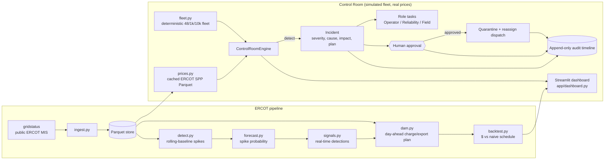

# GridSignal

Turning ERCOT grid data into battery dispatch signals that Base Power members can act on —
plus **GridSignal Control Room**, a simulation-only operator view that keeps a distributed
home-battery fleet coordinated when a device fails.

Built at the Base Power x AITX Talent Hackathon, Austin, Sep 25 to 27, 2026.

**Tracks:** Orchestration (Control Room) + Open Grid Data

> **Simulation only.** The fleet, the failure and the recovery are deterministic local mock data;
> only the ERCOT settlement prices are real (a cached public price trace). It does not connect to
> real devices, utilities, ERCOT operational systems or any control plane, and it never dispatches
> anything. A human operator must approve every recovery action.

## Problem

A home-battery fleet is only worth what it can reliably deliver during a grid event. When a single
device goes dark mid-event, the operator has to notice it, understand what it costs the fleet's
commitment, decide what to do, and coordinate engineers and field techs — usually across dashboards,
chat and spreadsheets, under time pressure.

## Solution

GridSignal Control Room closes that loop in one screen: telemetry loss becomes a typed incident with
a root-cause hypothesis and quantified impact, the orchestrator proposes a recovery plan and fans out
role-specific tasks, **a human approves**, and only then is the failed device quarantined and its
committed kW reassigned across healthy headroom — with an immutable audit timeline of the whole
sequence.

The impact is priced against **real ERCOT data**: the grid event sits on the most expensive
two-hour window of a real LZ_HOUSTON trading day, so the incident shows dollars at risk
(`kW x hours x $/MWh`) before approval and dollars recovered after it.

Two dials in the sidebar make that number mean something at Base's scale:

- **Price scenario** — a normal peak day (2026-09-22, peak $199.74/MWh) or a real ERCOT
  scarcity day (2023-09-06, peak $5,147.65/MWh, settlement at the offer cap plus reserve adders).
- **Fleet scale** — 48, 1,000 or 10,000 simulated devices. The failure is a gateway firmware
  ring that covers one device in 48, so a 10,000-device fleet loses 208 devices to the same
  root cause. On the scarcity day that is **$8,971 at risk and $8,684 recovered** from one
  operator approval, versus $1.82 on the 48-device normal day.

## Quick Start

One command starts the demo from a fresh clone (after install):

```bash
git clone https://github.com/Regantih/gridsignal.git
cd gridsignal
python3.11 -m venv .venv && source .venv/bin/activate
pip install -e ".[dev]"
streamlit run app/dashboard.py     # -> http://localhost:8501
```

No API keys, accounts or network access are required: a cached ERCOT price trace is bundled in
`data/processed/`. `.env` is optional and only used by the live-ERCOT pipeline
(`pip install -e ".[ercot]"`).

Refresh the cached prices from ERCOT's public MIS reports (needs the `[ercot]` extra and network,
still no credentials):

```bash
python -m gridsignal.ingest --date 2026-09-22          # LZ_HOUSTON real-time 15-min SPP
python -m gridsignal.ingest --scarcity-year 2023       # highest-priced day of that year
```

## Tests and formatting

```bash
pytest -q          # failure -> incident -> approval -> recovery state flow
ruff check .
ruff format --check .
```

## Using the dashboard

The sidebar **View** switch picks between the four pages:

### Control Room

- **Trigger BAT-042 Failure** (sidebar) — simulate the telemetry blackout.
- **Approve Recovery Plan** (incident panel) — the human gate; nothing moves until it is clicked.
- **Reset Demo** (sidebar) — replay the story without reloading the browser.
- **Price scenario / Fleet scale** (sidebar) — switch between the normal and scarcity ERCOT days
  and between 48, 1,000 and 10,000 devices; either rebuilds the simulation from its stable state.

### Member App

The same incident seen from one house, deliberately kept separate from the operator tooling:
hours of whole-home backup still held in reserve, the dollars the battery earned in the event and
the dollars it helped protect when a neighbour dropped out, plus a plain-English notice about the
device issue and its resolution. Pick any home in the sidebar; BAT-042 is the one that fails.
Trigger the failure from the Control Room (or the sidebar controls on this page) and the member
copy moves from "Your battery is healthy" to "We've lost contact with your battery" to
"Resolved" — with no incident IDs, kW targets or approval controls exposed to the homeowner.

Member-facing numbers use two explicit assumptions: a **1.2 kW essential household load** for
backup hours and a **60% member revenue share** of the grid value their battery creates. Neither
is a Base Power tariff.

### Grid Signals

An offline analytics view over the same bundled ERCOT day. The policy is **day-ahead anchored**:
charge and export windows are planned from the ERCOT DAM curve for that trade date — published
the afternoon before, so planning from it is not lookahead — and the real-time spike detector
only overrides the plan where real time has diverged from it (sell into a spike the day-ahead
curve never priced, refuse to buy a spike, wait out a dud export). Signals are advisory; nothing
is dispatched.

The headline shows two numbers side by side and never the first one alone: the scenario day at
the selected fleet scale ($65,500/day across 10,000 batteries on the 2023-09-06 scarcity day) and
the **held-out record** — mean +$0.62, median +$0.10 per battery per day, beating the naive
schedule on 6 of 7 days it was never tuned on (see
[Held-out results](#held-out-results-out-of-sample)). The scarcity day is the least
representative day in the set; the held-out average is the honest claim.

Same numbers from the CLI:

```bash
python -m gridsignal.pipeline --scenario scarcity --devices 10000
python -m gridsignal.holdout          # the held-out scorecard
```

Full walkthrough, safety boundaries and a 60–90 second demo script: [`docs/DEMO.md`](docs/DEMO.md).

### Agent Mesh

The orchestration layer, run as a mesh of agents instead of a single controller. Every battery,
gateway ring and load zone registers an **AgentFacts-style capability card** (id, kW and kWh
available, state of charge, zone, health, last heartbeat) signed with an HMAC key the registry
generates at startup. When capacity is lost, a **Coordinator** broadcasts a call for capacity,
healthy agents bid their spare kW at a price that reflects battery wear and how much of the
homeowner's backup reserve they would be giving up, and the coordinator awards the cheapest set
that covers the gap — as a *proposal*. Nothing is committed until a named human approves, and a
repeat trigger or a double-click on approve returns the award already on file rather than
committing the capacity twice. When the remaining headroom cannot cover the commitment the mesh
covers what it can and escalates the rest to a person.

The view shows the registry with each card marked **verified / stale / rejected** (a card edited
after signing fails verification; an agent that stops sending heartbeats goes stale, and neither
can win an award), the full message log of calls, bids, awards, approvals and escalations, and a
picker that replays any bundled chaos scenario.

Scenarios are YAML, in the spirit of NANDA Town's agent-town runs, and replay deterministically:

```bash
python -m gridsignal.simulate scenarios/zone_outage.yaml   # writes data/traces/zone_outage.jsonl
python -m gridsignal.simulate --all
```

| Scenario | What it injects | Result |
|---|---|---|
| `scenarios/single_device.yaml` | BAT-042 goes dark, 48 agents | 100% covered after one human approval |
| `scenarios/zone_outage.yaml` | whole LZ_HOUSTON gateway outage, 1,000 agents | partial cover, remainder escalated |
| `scenarios/lying_agent.yaml` | gateway ring outage + an agent that edits its card to claim 500 kW + silent telemetry | forged card rejected, silent agents stale, gap covered by the rest |
| `scenarios/silent_bidder.yaml` | two devices fail, then a winning bidder stops answering | its kW returns to the gap and a second round runs, also human-approved |
| `scenarios/fleet_wide_scarcity.yaml` | four zones lost during the scarcity event | more than the fleet can cover: partial commit and escalation |

Each run writes a JSONL trace (one message per line) and reports time to cover, percent of the
commitment covered, messages sent, and dollars at risk versus recovered. Everything is arithmetic
on the seeded fleet: no LLM, no API key, no network. An optional LLM coordinator
(`src/gridsignal/mesh/llm.py`) can rank bids behind an explicit flag; it is **off by default** and
falls back to the deterministic ranking when no provider is wired up.

**Inspiration and attribution.** The agent-card, registry and agent-town-scenario ideas are
inspired by MIT Project NANDA — [nandatown.projectnanda.org](https://nandatown.projectnanda.org)
and [github.com/projnanda](https://github.com/projnanda). No NANDA code is vendored, copied or
depended on here; the registry, the signing scheme, the contract-net protocol and the scenario
format in this repo are original implementations of those ideas against this simulated fleet.

## Tech Stack and Architecture

- Python 3.11, Streamlit, Plotly, pandas
- `gridstatus` + scikit-learn only for refreshing ERCOT data and the optional pipeline
  (`.[ercot]` extra)
- Control Room state lives in memory; ERCOT prices are cached as Parquet in `data/processed/`



| Module | Responsibility |
|---|---|
| `src/gridsignal/fleet.py` | Deterministic synthetic fleet (seeded, 48/1,000/10,000 devices, BAT-042 is the demo device) and its gateway rings |
| `src/gridsignal/control_room/models.py` | Device, GridEvent, Incident, Task, AuditEvent, FleetSnapshot |
| `src/gridsignal/control_room/engine.py` | State machine: baseline → failure → incident → **human approval** → recovery |
| `src/gridsignal/ingest.py` | Pulls real-time settlement point prices from ERCOT via gridstatus and caches them as Parquet |
| `src/gridsignal/prices.py` | Named price scenarios, cached-trace loading, peak-window selection, kW to dollars |
| `src/gridsignal/detect.py` | Rolling trailing-median baseline with a MAD spread; flags spike intervals and groups them into windows |
| `src/gridsignal/forecast.py` | Causal spike-probability score from the z-score, its ramp and the price-over-baseline level |
| `src/gridsignal/signals.py` | Real-time-only fallback policy: declining reservation price turning prices plus spike probability into charge/hold/export |
| `src/gridsignal/dam.py` | Plans the day from the ERCOT day-ahead curve and applies the real-time deviation rules on top; the frozen parameters live here |
| `src/gridsignal/backtest.py` | Battery settlement ledger (SoC, cashflow) for the signals and for a naive fixed schedule |
| `src/gridsignal/pipeline.py` | `run(scenario)` wiring detect → forecast → signals → backtest, plus a CLI |
| `src/gridsignal/mesh/cards.py` | AgentFacts-style capability cards and their HMAC signatures |
| `src/gridsignal/mesh/registry.py` | In-memory registry: register, publish, discover by capability, reject bad signatures, expire silent agents |
| `src/gridsignal/mesh/messages.py` | Append-only message bus and the JSONL trace format |
| `src/gridsignal/mesh/build.py` | Turns the simulated fleet into battery, gateway and zone agents publishing spare capacity |
| `src/gridsignal/mesh/negotiation.py` | Contract net: call for capacity, bidding, cheapest-cover awards, the human gate, idempotent commitments |
| `src/gridsignal/mesh/scenarios.py` | YAML chaos scenarios: seed, agent counts, failure injections, duration |
| `src/gridsignal/mesh/llm.py` | Optional LLM bid ranker behind a flag, disabled by default |
| `src/gridsignal/simulate.py` | `python -m gridsignal.simulate <scenario>`: deterministic chaos run, metrics and JSONL trace |
| `src/gridsignal/member.py` | Member-facing summary for one home: backup hours, earned/protected dollars, plain-English notice |
| `src/gridsignal/holdout.py` | Replays the frozen policy over the bundled held-out days and scores it against the naive schedule |
| `scripts/fetch_holdout.py` | Caches the held-out days from ERCOT (needs `.[ercot]` and network); the selection rule is in its docstring |
| `scripts/fetch_tuning.py` | Caches the tuning split, chosen so it can never overlap the held-out dates |
| `scripts/fetch_dam.py` | Caches the day-ahead curve and provenance for every bundled trade date |
| `scripts/tune_policy.py` | Grid search for the frozen policy parameters, run on the tuning split only |
| `app/dashboard.py` | Single-page operator UI: overview, map/grid, price trace, incident, tasks, audit, demo controls |
| `tests/test_control_room.py` | End-to-end coverage of the failure-to-recovery flow, including the dollar math |
| `tests/test_prices.py`, `tests/test_ingest.py` | Scenario loading, peak-window selection, dollar conversion, cache provenance |
| `tests/test_scale.py` | Gateway-ring scaling, scarcity pricing, and a 10,000-device detect-plus-reallocate benchmark |
| `tests/test_detect.py`, `tests/test_forecast.py`, `tests/test_signals.py`, `tests/test_backtest.py`, `tests/test_pipeline.py` | The analytics pipeline: spike detection, look-ahead safety, dispatch policy, settlement math, end-to-end run |
| `tests/test_holdout.py` | Split integrity: ≥5 real held-out days with provenance, tuning and held-out dates disjoint, frozen parameters, losing days kept in the totals |
| `tests/test_mesh.py` | Signature rejection, staleness, capability discovery, bid pricing and selection, the approval gate, idempotency, partial cover plus escalation |
| `tests/test_simulate.py` | Scenario coverage of every failure mode, deterministic replay, JSONL traces, the CLI, and a 10,000-agent negotiation benchmark |
| `tests/test_dashboard.py` | Every view renders; the Grid Signals headline never shows the scenario day alone; the Agent Mesh registry and log |
| `tests/test_dam.py` | Day-ahead plan shape, hour-to-interval alignment, each deviation rule, no-lookahead, DAM provenance |

See [`docs/architecture.md`](docs/architecture.md) for the data-pipeline side.

## Reproducing the Demo

1. `streamlit run app/dashboard.py`, open http://localhost:8501.
2. Click **Trigger BAT-042 Failure**, read the incident panel, click **Approve Recovery Plan**.
3. Click **Reset Demo** to replay. Results are identical every run (seeded simulation).

Optional live-data path: `pip install -e ".[ercot]"`, then `python -m gridsignal.ingest --date
<recent date>` to refresh the cached trace before running the pipeline against it.

## Data and Provenance

| Dataset | Source | Notes |
|---|---|---|
| Simulated battery fleet | `src/gridsignal/fleet.py` | Seeded synthetic data, no real customer or device data |
| Simulated grid event | `src/gridsignal/control_room/engine.py` | 5 kW per device over 2 h (240 kW at 48 devices, 50 MW at 10,000); the window is chosen from the real price trace |
| Real-time settlement point prices | ERCOT MIS [NP6-905-CD](https://www.ercot.com/mp/data-products/data-product-details?id=NP6-905-CD) via `gridstatus`, public and credential-free | **Real data.** LZ_HOUSTON, REAL_TIME_15_MIN, 2026-09-22 (96 intervals, peak $199.74/MWh). Cached at `data/processed/lz_houston_rtm_spp_sample.parquet` with provenance in the sidecar `.json`; refresh with `python -m gridsignal.ingest --date <YYYY-MM-DD>` |
| Scarcity-day settlement prices | ERCOT MIS [NP6-785-ER](https://www.ercot.com/mp/data-products/data-product-details?id=NP6-785-ER) historical archive via `gridstatus`, public and credential-free | **Real data.** LZ_HOUSTON, REAL_TIME_15_MIN, 2023-09-06 — the highest-priced LZ_HOUSTON day of 2023 (96 intervals, peak $5,147.65/MWh, day average $788.49/MWh). The archive restates some intervals, so repeated intervals are averaged into one row. Cached at `data/processed/lz_houston_rtm_spp_scarcity_sample.parquet` with a sidecar `.json`; refresh with `python -m gridsignal.ingest --scarcity-year <YYYY>` |
| Held-out evaluation days | ERCOT MIS [NP6-785-ER](https://www.ercot.com/mp/data-products/data-product-details?id=NP6-785-ER) historical archive and [NP6-905-CD](https://www.ercot.com/mp/data-products/data-product-details?id=NP6-905-CD) daily report via `gridstatus` | **Real data.** Seven LZ_HOUSTON REAL_TIME_15_MIN days, 96 intervals each, cached under `data/holdout/` with a sidecar `.json` per day; refresh with `python scripts/fetch_holdout.py` |
| Tuning days | same ERCOT sources via `gridstatus` | **Real data.** Six LZ_HOUSTON REAL_TIME_15_MIN days under `data/tuning/`, chosen by the quantile rule in `scripts/fetch_tuning.py` so they never collide with the held-out dates. These plus the two scenario days are the only days any parameter may be fitted on; refresh with `python scripts/fetch_tuning.py` |
| Day-ahead settlement point prices | ERCOT MIS [NP4-190-CD](https://www.ercot.com/mp/data-products/data-product-details?id=NP4-190-CD) and the DAM historical archive via `gridstatus` | **Real data.** LZ_HOUSTON, DAY_AHEAD_HOURLY, 24 hours for every bundled trade date, cached beside each real-time trace as `*_dam.parquet` with a sidecar `*_dam.json`; refresh with `python scripts/fetch_dam.py`. DAM results clear the afternoon **before** the trade day, which is why the plan may use them |
| System load / fuel mix | ERCOT, via gridstatus | Not implemented yet (`ingest.fetch_load`, `ingest.fetch_fuel_mix`) |

Dollars are computed as `kW x hours x $/MWh / 1000` over the part of the event window that is still
ahead. Both price days are real; the fleet, the outage and the recovery are simulated, and the
historical scarcity trace is pricing context only — it is not replayed as a real-time market feed.

## Held-out results (out of sample)

Parameters are fitted on the **tuning split only** — the two scenario days plus the six days in
`data/tuning/` — by the grid search in `scripts/tune_policy.py`, which maximises *median* uplift
per battery per day so that one scarcity day cannot buy a parameter set that bleeds on ordinary
days. The winning values are frozen in `gridsignal.dam` and asserted by a test. These seven
held-out days were then scored **once**, and the losing day is printed as it came out.

Day selection is a rule, not a hand-pick (`scripts/fetch_holdout.py`): for each year the ERCOT
archive parses, take that year's highest-priced LZ_HOUSTON day and its median-peak day; 2023's
peak day is excluded because it is a scenario day. The archive does not parse 2026 yet, so the
two most recent complete trade days from the daily report are used instead. The tuning split
(`scripts/fetch_tuning.py`) takes the 75th and 25th percentile of daily peak in each year, so the
two splits can never share a date.

All figures are **dollars per battery per day** on a 13.5 kWh / 5 kW battery (see Assumptions).

| Date | Peak $/MWh | Regime | GridSignal $ | Naive $ | Uplift $ |
|---|---:|---|---:|---:|---:|
| 2023-04-06 | 86.13 | ordinary | 0.21 | 0.19 | **+0.02** |
| 2024-05-08 | 4,981.40 | scarcity | 17.84 | 16.13 | **+1.71** |
| 2024-12-20 | 73.13 | ordinary | 0.28 | 0.27 | **+0.01** |
| 2025-04-07 | 3,860.63 | scarcity | 1.20 | −0.97 | **+2.17** |
| 2025-05-03 | 76.33 | ordinary | 0.62 | 0.01 | **+0.61** |
| 2026-09-23 | 97.76 | ordinary | 0.19 | 0.46 | **−0.27** |
| 2026-09-24 | 108.74 | ordinary | 0.67 | 0.57 | **+0.10** |

**6 of 7 held-out days beat the naive schedule.** Mean +$0.62, median +$0.10, worst −$0.27, best
+$2.17 per battery per day.

This is the result of anchoring the plan to the day-ahead curve. The previous real-time-only
policy won 2 of 7 days (mean −$0.15, worst −$4.89) because it held charge waiting for spikes that
never came; planning the windows from a price curve the operator genuinely has in advance removes
most of that guesswork, and the real-time detector now only has to catch the divergence. Read it
conservatively all the same: the median day is worth ten cents, one held-out day still loses, and
most of the mean comes from two scarcity days — a fleet-level claim built on the scarcity day
alone would be dishonest.

Reproduce with `python -m gridsignal.holdout`.

### Assumptions (not measured fleet data)

Member view: essential household load **1.2 kW** (backup hours = reserved kWh ÷ 1.2 kW), member
revenue share **60%** of the grid-event value their battery creates.

Every dollar figure in this repository rests on these stated assumptions about a single home
battery. They are round numbers chosen to be representative; they are **not** measurements of any
real Base Power device or fleet.

| Assumption | Value | Where |
|---|---|---|
| Usable energy capacity | 13.5 kWh | `backtest.DEFAULT_KWH` |
| Inverter power, charge and discharge | 5 kW (so 1.25 kWh per 15-minute interval) | `backtest.DEFAULT_POWER_KW` |
| Round-trip efficiency | 90% | `backtest.ROUND_TRIP_EFFICIENCY` |
| Naive baseline schedule | charge 01:00–05:00, export 17:00–21:00 | `backtest.NAIVE_CHARGE_HOURS`, `NAIVE_EXPORT_HOURS` |
| Starting state of charge | empty at 00:00 | `backtest.value_captured` |
| Market participation | price taker settling at the RTM SPP; no bidding, no ancillary revenue, no degradation cost, no losses beyond round-trip efficiency | `backtest.py` |
| Control Room event | 5 kW of capacity per affected device over a 2-hour window | `control_room/engine.py` |

## Known Limitations and Next Steps

- The Control Room is a simulation: no device protocol, no telemetry ingest, no persistence
  (state lives in the Streamlit session and resets on server restart).
- Detection is a single rule (telemetry staleness) on one scripted device rather than a monitor
  over a real event stream.
- The spike forecast is a fixed-coefficient logistic score, not a trained model, and the backtest
  is a price-taker single-day replay: no bidding, no ancillary services, no degradation cost.
- **The out-of-sample edge is small and concentrated**: 6 of 7 held-out days beat naive, but the
  median day is +$0.10 and most of the mean comes from two scarcity days. Day-ahead anchoring
  fixed the previous generalisation failure; it did not turn this into a revenue product.
- The day-ahead plan is a top-k hour selection, not an optimiser: no state-of-charge-aware
  dynamic program, no forecast error model on the DAM-to-RTM basis.
- Load and fuel-mix ingest are implemented but not yet used by either view.
- ERCOT's public SPP report only keeps roughly the last week online, so `--date` must be recent;
  scarcity days come from the yearly historical archive instead. Both bundled samples are the
  cached copies that keep the demo reproducible and offline.
- Scaling is a device multiplier on one seeded template, not a model of real per-home diversity,
  and the fleet map thins healthy markers above 400 devices.
- The agent mesh runs in simulated seconds inside one process: there is no transport, no real
  cryptographic identity beyond a shared HMAC key, and agents do not defect strategically — a
  "lying" agent lies about its capabilities, not about delivery it actually made.
- Next: drive the whole event window as a replay (price tick by price tick) so the operator sees
  exposure change minute to minute rather than as a single window average.

## Team

| Name | Role | Contact |
|---|---|---|
| Hemanth Reganti | Lead | regantih@gmail.com |

## Hackathon Compliance

All code in this repo was written during the hackathon (Sep 25 to 27, 2026). Third-party
open-source libraries are listed in `pyproject.toml`.
