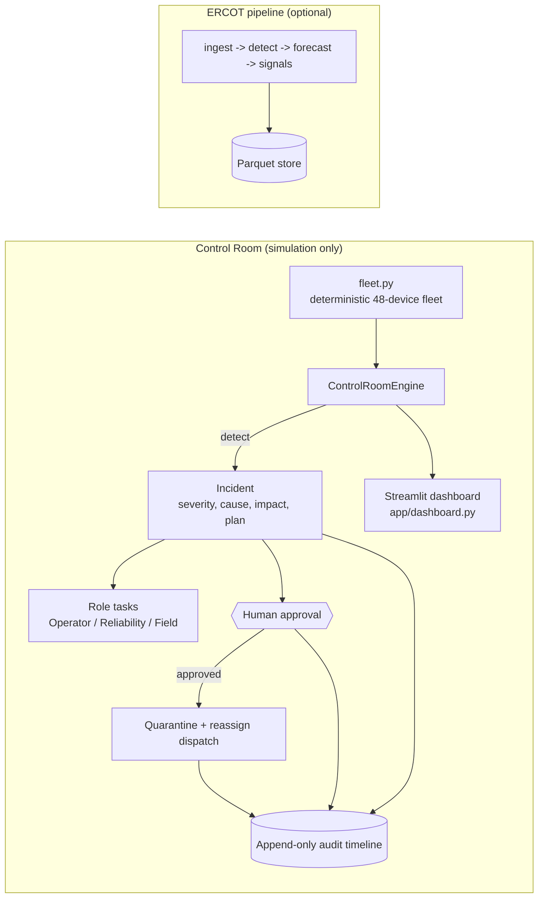

# GridSignal

Turning ERCOT grid data into battery dispatch signals that Base Power members can act on —
plus **GridSignal Control Room**, a simulation-only operator view that keeps a distributed
home-battery fleet coordinated when a device fails.

Built at the Base Power x AITX Talent Hackathon, Austin, Sep 25 to 27, 2026.

**Tracks:** Orchestration (Control Room) + Open Grid Data

> **Simulation only.** The Control Room uses deterministic local mock data. It does not connect to
> real devices, utilities, ERCOT systems or any operational control plane, and it never dispatches
> anything. A human operator must approve every recovery action.

## Problem

A home-battery fleet is only worth what it can reliably deliver during a grid event. When a single
device goes dark mid-event, the operator has to notice it, understand what it costs the fleet's
commitment, decide what to do, and coordinate engineers and field techs — usually across dashboards,
chat and spreadsheets, under time pressure.

## Solution

GridSignal Control Room closes that loop in one screen: telemetry loss becomes a typed incident with
a root-cause hypothesis and quantified impact, the orchestrator proposes a recovery plan and fans out
role-specific tasks, **a human approves**, and only then is the failed device quarantined and its
committed kW reassigned across healthy headroom — with an immutable audit timeline of the whole
sequence. The original ERCOT signal pipeline (`python -m gridsignal.pipeline`) remains as the data
side of the project.

## Quick Start

One command starts the demo from a fresh clone (after install):

```bash
git clone https://github.com/Regantih/gridsignal.git
cd gridsignal
python3.11 -m venv .venv && source .venv/bin/activate
pip install -e ".[dev]"
streamlit run app/dashboard.py     # -> http://localhost:8501
```

No API keys, accounts or network access are required. `.env` is optional and only used by the
live-ERCOT pipeline (`pip install -e ".[ercot]"`).

## Tests and formatting

```bash
pytest -q          # failure -> incident -> approval -> recovery state flow
ruff check .
ruff format --check .
```

## Using the Control Room

- **Trigger BAT-042 Failure** (sidebar) — simulate the telemetry blackout.
- **Approve Recovery Plan** (incident panel) — the human gate; nothing moves until it is clicked.
- **Reset Demo** (sidebar) — replay the story without reloading the browser.

Full walkthrough, safety boundaries and a 60–90 second demo script: [`docs/DEMO.md`](docs/DEMO.md).

## Tech Stack and Architecture

- Python 3.11, Streamlit, Plotly, pandas
- `gridstatus` + scikit-learn only for the optional live-ERCOT pipeline (`.[ercot]` extra)
- Control Room state lives in memory; the ERCOT pipeline uses local Parquet in `data/`



| Module | Responsibility |
|---|---|
| `src/gridsignal/fleet.py` | Deterministic synthetic fleet (seeded, 48 devices, BAT-042 is the demo device) |
| `src/gridsignal/control_room/models.py` | Device, GridEvent, Incident, Task, AuditEvent, FleetSnapshot |
| `src/gridsignal/control_room/engine.py` | State machine: baseline → failure → incident → **human approval** → recovery |
| `app/dashboard.py` | Single-page operator UI: overview, map/grid, incident, tasks, audit, demo controls |
| `tests/test_control_room.py` | End-to-end coverage of the failure-to-recovery flow |

See [`docs/architecture.md`](docs/architecture.md) for the data-pipeline side.

## Reproducing the Demo

1. `streamlit run app/dashboard.py`, open http://localhost:8501.
2. Click **Trigger BAT-042 Failure**, read the incident panel, click **Approve Recovery Plan**.
3. Click **Reset Demo** to replay. Results are identical every run (seeded simulation).

Optional live-data path: `pip install -e ".[ercot]"`, copy `.env.example` to `.env`, then
`python -m gridsignal.pipeline --start 2026-08-01 --end 2026-09-24`.

## Data and Provenance

| Dataset | Source | Notes |
|---|---|---|
| Simulated battery fleet | `src/gridsignal/fleet.py` | Seeded synthetic data, no real customer or device data |
| Simulated grid event | `src/gridsignal/control_room/engine.py` | ERCOT-style peak-demand window, values are illustrative |
| Real-time settlement point prices | ERCOT, via gridstatus | Optional pipeline only, not used by the Control Room |
| System load / fuel mix | ERCOT, via gridstatus | Optional pipeline only |

## Known Limitations and Next Steps

- The Control Room is a simulation: no device protocol, no telemetry ingest, no persistence
  (state lives in the Streamlit session and resets on server restart).
- Detection is a single rule (telemetry staleness) on one scripted device rather than a monitor
  over a real event stream.
- The ERCOT pipeline modules (`ingest`, `detect`, `forecast`, `signals`, `backtest`) are still
  stubs.
- Next: replay real ERCOT price/load traces into the simulated event so the incident impact is
  expressed in dollars at risk as well as kW.

## Team

| Name | Role | Contact |
|---|---|---|
| Hemanth Reganti | Lead | regantih@gmail.com |

## Hackathon Compliance

All code in this repo was written during the hackathon (Sep 25 to 27, 2026). Third-party
open-source libraries are listed in `pyproject.toml`.
