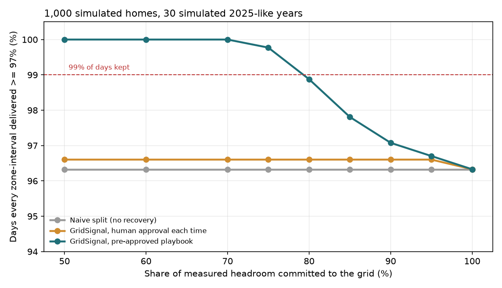
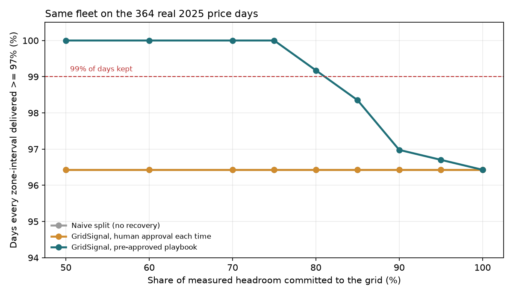
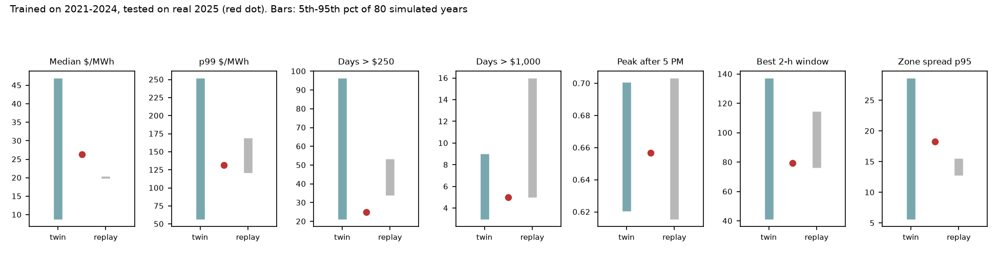

# GridSignal Twin: stress-test report

Generated by `python -m gridsignal.twin report`. Every number below is recomputed from code and data in this repo. Prices come from real ERCOT history; the fleet is simulated.

## Headline

- On 30 simulated 2025-like years, a 1,000-home fleet using GridSignal's recovery rule with a **pre-approved playbook** can commit **75%** of its measured headroom and still deliver on 99% of days.
- With a **human approval** before each reassignment, or with **no recovery**, no commitment level reaches 99%: the interval a unit drops in is always short, because the fix lands one interval late.
- At 75% committed: kept days **99.8%** (playbook) vs **96.3%** (naive); shortfall **0.2 MWh/yr** vs **20.3 MWh/yr**; batteries sent below the member reserve: **none** (closest approach 0.000 kWh above reserve, across every policy and level).
- Design consequence for GridSignal: keep humans approving the *playbook* (and anything outside it), not every routine reassignment. That is a change from the hackathon build, which asks for approval every time.



## Scenarios

| Scenario | Safe commit (naive) | Safe commit (approval each time) | Safe commit (playbook) | Energy value at playbook-safe level, $/yr | Hot-day kept rate at that level |
|---|---|---|---|---|---|
| 2025-like (latest year) | none reach 99% | none reach 99% | 75% | $164,490 | 98.5% |
| 2025-like, spikes halved | none reach 99% | none reach 99% | 80% | $164,032 | 93.3% |
| 2023-like (scarce summer) | none reach 99% | none reach 99% | 75% | $394,095 | 99.1% |
| 2021-like (includes Winter Storm Uri) | none reach 99% | none reach 99% | 75% | $514,767 | 98.9% |
| Any past year (drawn) | none reach 99% | none reach 99% | 75% | $408,480 | 98.4% |
| Real 2025 days (reality check) | none reach 99% | none reach 99% | 80% | $190,573 | 100.0% |

Prices move the *value* a lot (compare 2023-like with 2025-like) but barely move the *safe commitment*: reliability is set by the fleet, not the market. Energy value is delivered MWh times the real-time price in the planned window, before any fees or wear.



## Is the price world model any good?

Fitted on 1,821 real days (2021-01-01 to 2025-12-31) of ERCOT real-time 15-minute prices for Houston, North and South load zones. 12 PCA components explain 92% of the variance (in asinh space); 16 day types.

- **Forecast test (all years, latest regime)**: fit on the years before, simulate the next year 80 times, check whether the real year lands inside the 5th-95th percentile band. Twin: **13/21** checks. Replaying real days from last year: **7/21**.
- **Forecast test (trailing year)**: fit on the years before, simulate the next year 80 times, check whether the real year lands inside the 5th-95th percentile band. Twin: **9/21** checks. Replaying real days from last year: **7/21**.
- **Imitation test**: asked to imitate a given year, the twin's band covers **20/35** of that year's metrics, without copying its days.

Read the coverage honestly: the twin's bands are wide on purpose, because it carries year-to-year level risk (a lognormal shift fit on how much the median moved between real years). Replay bands are narrow and confidently wrong. A wide band that contains the truth is more useful for sizing a commitment than a narrow one that misses, but it is not a sharp forecast.



**What it cannot do.** No model fitted to past years predicted how fast ERCOT's price spikes disappeared: days over $250 went 116 (2022), 94 (2023), 44 (2024), 25 (2025). The twin treats scarcity as an explicit scenario (regime and `scarcity` knob) rather than pretending to forecast it. It also under-produces the most extreme years' spike counts when imitating them.

| Test year | Metric | Real | Twin 5th-95th | Replay 5th-95th |
|---|---|---|---|---|
| 2023 | Median price ($/MWh) | 21.7 | 20.3 to 106 ok | 45.9 to 48.3 |
| 2023 | 99th pct price ($/MWh) | 572 | 209 to 467 | 399 to 718 ok |
| 2023 | Days over $250 | 94.0 | 77.9 to 181 ok | 103 to 128 |
| 2023 | Days over $1,000 | 34.0 | 6.00 to 21.0 | 18.0 to 31.1 |
| 2023 | Share of days peaking after 5 PM | 0.58 | 0.41 to 0.50 | 0.41 to 0.49 |
| 2023 | Best 2-hour window, mean ($/MWh) | 225 | 102 to 260 ok | 181 to 252 ok |
| 2023 | Houston-North spread, 95th pct | 12.5 | 10.8 to 45.6 ok | 22.1 to 27.3 |
| 2024 | Median price ($/MWh) | 20.0 | 7.38 to 50.8 ok | 21.4 to 21.9 |
| 2024 | 99th pct price ($/MWh) | 139 | 224 to 630 | 394 to 898 |
| 2024 | Days over $250 | 44.0 | 59.0 to 133 | 82.0 to 105 |
| 2024 | Days over $1,000 | 11.0 | 18.0 to 33.0 | 27.0 to 42.0 |
| 2024 | Share of days peaking after 5 PM | 0.66 | 0.50 to 0.59 | 0.54 to 0.61 |
| 2024 | Best 2-hour window, mean ($/MWh) | 91.6 | 140 to 273 | 179 to 277 |
| 2024 | Houston-North spread, 95th pct | 14.1 | 4.41 to 27.8 ok | 11.3 to 14.8 ok |
| 2025 | Median price ($/MWh) | 26.3 | 8.70 to 47.0 ok | 19.8 to 20.4 |
| 2025 | 99th pct price ($/MWh) | 131 | 56.2 to 252 ok | 121 to 169 ok |
| 2025 | Days over $250 | 25.0 | 21.0 to 96.4 ok | 34.0 to 53.1 |
| 2025 | Days over $1,000 | 5.00 | 2.95 to 9.00 ok | 5.00 to 16.0 ok |
| 2025 | Share of days peaking after 5 PM | 0.66 | 0.62 to 0.70 ok | 0.62 to 0.70 ok |
| 2025 | Best 2-hour window, mean ($/MWh) | 79.5 | 40.9 to 137 ok | 76.3 to 115 ok |
| 2025 | Houston-North spread, 95th pct | 18.3 | 5.57 to 28.6 ok | 12.8 to 15.5 |

## Fleet assumptions (simulated, change them in `FleetAssumptions`)

| Assumption | Value |
|---|---|
| `homes` | 1000 |
| `zone_share` | [0.4, 0.35, 0.25] |
| `large_share` | 0.25 |
| `large_kwh` | 39.2 |
| `large_kw` | 20.0 |
| `small_kwh` | [25.0, 27.5, 30.0] |
| `small_kw` | [5.0, 7.5, 10.0] |
| `soc_mean` | 0.8 |
| `soc_spread` | 0.1 |
| `reserve_fraction` | 0.2 |
| `home_load_kw` | 1.6 |
| `hot_day_load_factor` | 1.35 |
| `degraded_share` | 0.04 |
| `device_hazard_per_h` | 0.004 |
| `feeder_event_p` | 0.01 |
| `feeder_event_p_hot` | 0.06 |
| `feeder_event_share` | 0.25 |
| `recovery_delay_steps` | 1 |
| `kept_tolerance` | 0.97 |

## Sensitivity: what if the assumptions are wrong?

Each row doubles or halves one assumption on 2025-like prices.

| Assumption | Value | Safe commit, naive | Safe commit, approval each time | Safe commit, playbook |
|---|---|---|---|---|
| `device_hazard_per_h` | 0.002 | none reach 99% | none reach 99% | 80% |
| `device_hazard_per_h` | 0.008 | none reach 99% | none reach 99% | 75% |
| `feeder_event_p_hot` | 0.03 | none reach 99% | none reach 99% | 80% |
| `feeder_event_p_hot` | 0.12 | none reach 99% | none reach 99% | 75% |
| `feeder_event_share` | 0.125 | none reach 99% | none reach 99% | 90% |
| `feeder_event_share` | 0.5 | none reach 99% | none reach 99% | 50% |
| `home_load_kw` | 0.8 | none reach 99% | none reach 99% | 75% |
| `home_load_kw` | 3.2 | none reach 99% | none reach 99% | 75% |
| `recovery_delay_steps` | 0 | none reach 99% | 75% | 75% |
| `recovery_delay_steps` | 2 | none reach 99% | none reach 99% | 75% |

The assumption that matters most is `feeder_event_share`: at 0.5 the playbook-safe level falls to 50% (the lowest level tested). Correlated outages (a feeder taking out many homes in one zone at once) are what the recovery rule cannot absorb, because the spare has to sit in the same zone. That is the first number to measure on a real fleet. Removing the approval delay (`recovery_delay_steps` = 0) makes the as-built GridSignal match the playbook, which confirms the delay, not the allocation rule, is the gap.

## How to reproduce

```bash
pip install -e '.[dev]'
pytest -q
python -m gridsignal.twin report   # about 20 minutes
```

